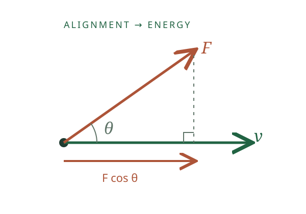
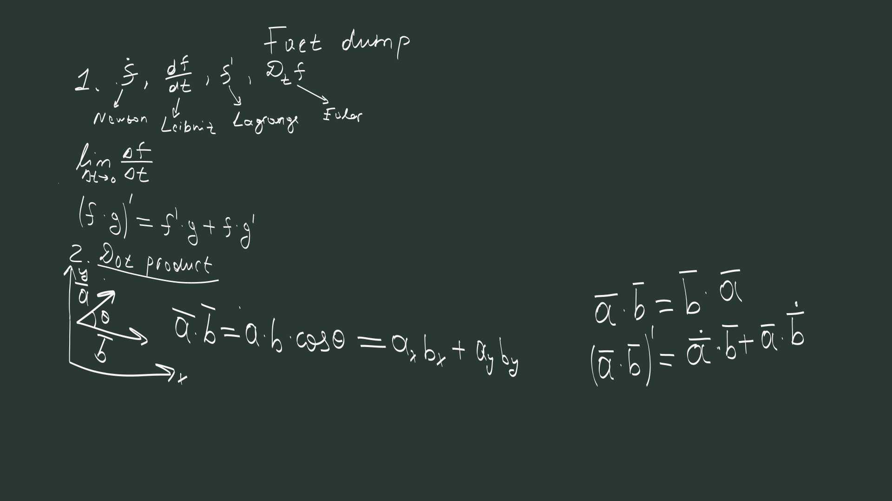
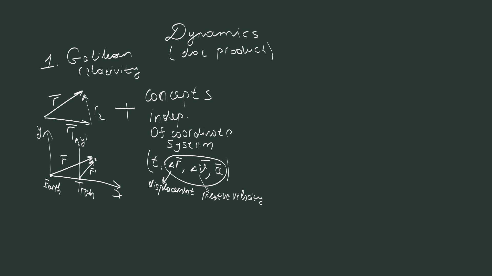
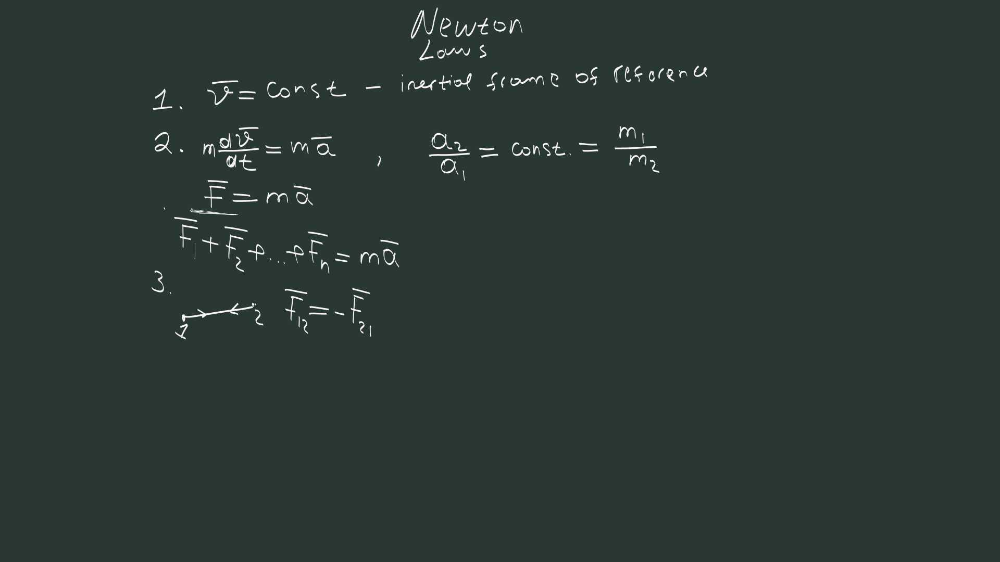
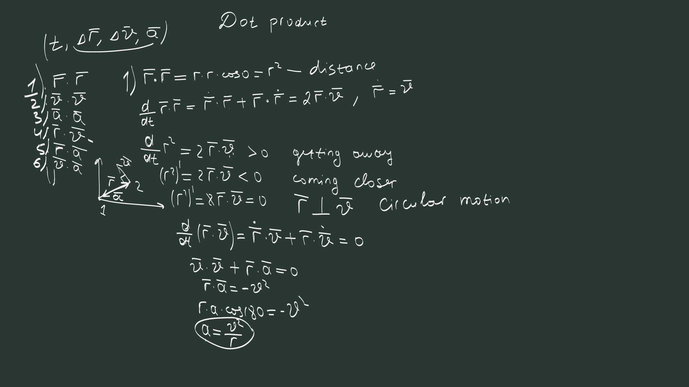
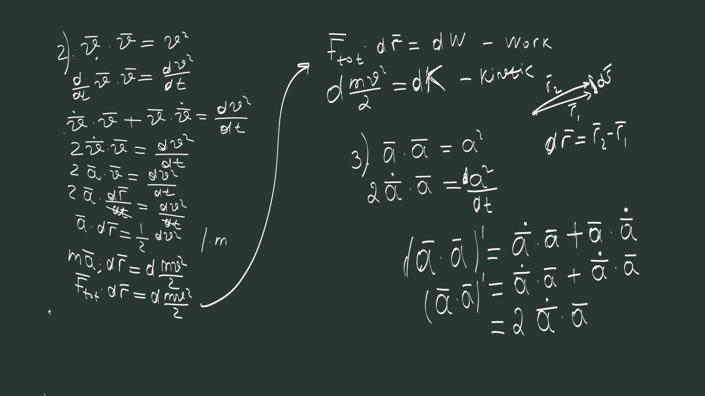
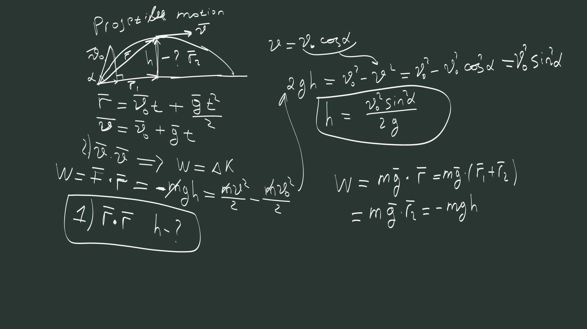

## Dynamics {#dynamics .opening}

Lecture 03 · Tilek Zhumabek

The dot product opens the door to energy.

A new operation → a physical law → a powerful shortcut

Our destination: find the height of a projectile without finding the time.

::: {.notes}
Make the promise explicit: vectors are the language of physics. Today we keep
the promise by learning a new operation before using it to open dynamics.
The peak of this lecture is work and energy. Everything before it earns that result.
:::

## A new operation, a new part of physics {#promise}

<strong>+ and −</strong>
Kinematics
<small>Combine motions. Find changes.</small>

<strong>Dot product ·</strong>
Dynamics
<small>Measure alignment. Find work and energy.</small>

<strong>Cross product ×</strong>
Rotational dynamics
<small>Describe turning effects. Torque comes next.</small>

Vectors are the language. Operations let us say new things.

::: {.notes}
Recall the swimmer and the changing velocity from the first lecture. Do not
teach the cross product here: this is a signpost. The new operation is the
organising idea, not an assertion that earlier operations stop being useful.
:::

## What does the dot product see? {#alignment}

$$\mathbf A\cdot\mathbf B=AB\cos\theta.$$

It measures <em>alignment</em>.

Same direction: positive. Perpendicular: zero. Opposite directions: negative.

::: {.notes}
Push a trolley along its motion, against it, and sideways. Ask what changes.
The definition comes before the dynamics. The projection is signed: beyond
90 degrees it points against the other vector. Board 2 supplies the same geometry.
:::

## Extract the length from the arrow {#squared-length}

$$\mathbf A\cdot\mathbf A=A^2.$$

Position → squared distance. Velocity → squared speed.

Rotating the coordinate axes changes the components, not the dot product.

::: {.notes}
The original board shows the two-dimensional component formula. In three
dimensions add Az Bz. Our main use is A dot A. The dot product gives a scalar;
this does not mean every moving observer measures the same value. The next
section gives that distinction a physical setting.
:::

## One ball, two observers {#train}

Throw a ball vertically inside a smoothly moving train.

You see a vertical path. The platform sees a parabola.

Which description is right?

::: {.notes}
Both descriptions are right. The train has constant velocity U. Neglect air
resistance. Use parallel nonrotating axes and coincident origins at t=0.
Invite students to reconstruct the position sum from the previous lectures.
:::

## Different velocities. Same acceleration. {#galileo}

$$\mathbf r=\mathbf U t+\mathbf r'.$$
$$\mathbf v=\mathbf U+\mathbf v'.$$

$$\mathbf a=\mathbf a'.$$

The constant train velocity disappears on differentiation.

What determines the acceleration they agree on?

::: {.notes}
Newtonian time is shared. Relative velocities and simultaneous separations
also agree because the common frame terms cancel. Displacement over time
does not: a seated passenger moves relative to the platform. Keep the main
spoken point on acceleration. Galilean relativity says the mechanical laws
have the same form in all inertial frames; it does not derive Newton's second law.
:::

## First law: free motion is the baseline {#first-law}

Newton · Which frames can we use?

A free particle keeps a constant velocity.

$$\mathbf v=\text{constant}.$$

Frames in which free particles behave this way are <em>inertial frames</em>.

Force changes motion. It does not sustain uniform motion.

::: {.notes}
Rest is one constant velocity, not a privileged condition. The smoothly moving
train and platform are our ideal inertial frames. If the train brakes, the
simple free-motion description no longer holds in the train frame. Do not
develop fictitious forces now. Transition: what sets the amount of change?
:::

## Second law: add the forces on one body {#second-law}

$$\boxed{\mathbf F_{\mathrm{net}}=\sum_i\mathbf F_i=m\mathbf a.}$$

Same force. Same mass. Same acceleration. The train and platform use the same law.

Our particle has constant mass; forces are the Newtonian interactions used in this lecture.

::: {.notes}
For a given net force, increasing mass decreases acceleration. For a given
mass, increasing the force increases acceleration. First choose the body,
then add all forces on it. This is the bridge from Galilean relativity:
different velocity descriptions give the same acceleration equation.
:::

## Third law: an interaction has two sides {#third-law}

$$\mathbf F_{A\to B}=-\mathbf F_{B\to A}.$$

Equal and opposite forces. <em>Different bodies.</em>

Add the momentum equations of an isolated pair:

$$\frac{d}{dt}(\mathbf p_A+\mathbf p_B)=0,
\qquad \mathbf p=m\mathbf v.$$

Addition reveals momentum. What will the dot product reveal?

::: {.notes}
Keep this payoff brief. Internal forces cancel in the combined system equation,
not in either individual body's equation. Introduce p as m v for constant
mass. Do not suggest equal and opposite forces cancel their work: the points
of application can move differently. Turn the attention to the dot product.
:::

## One derivative rule is enough {#product-rule}

Make the new operation work on changing vectors

$$\frac{d}{dt}(\mathbf A\cdot\mathbf B)
=\dot{\mathbf A}\cdot\mathbf B+\mathbf A\cdot\dot{\mathbf B}.$$

Each vector gets its turn to change.

$$\frac{d}{dt}(\mathbf A\cdot\mathbf A)=2\mathbf A\cdot\dot{\mathbf A}.$$

Use it for position. Then use it for velocity.

::: {.notes}
This is the product rule. Linearity is the separate rule for differentiating
a sum. A dot over a symbol means its time derivative. If needed, prove the
identity by applying the ordinary product rule to Ax Bx + Ay By. Avoid a
catalogue of derivative notation. The students need this one usable tool.
:::

## Are we moving farther away? {#distance-change}

$$\frac{d}{dt}r^2=2\mathbf r\cdot\mathbf v.$$

<strong>Positive</strong>
Farther away.

<strong>Negative</strong>
Coming closer.

<strong>Zero</strong>
Distance is momentarily unchanged.

What if the distance stays fixed?

Measure position from a fixed origin.

::: {.notes}
r squared is squared distance from that origin. At a nonzero radius its rate
has the same sign as the distance's rate. Zero at just one instant does not
mean circular motion. Now impose a fixed radius throughout the motion, in a plane.
:::

## A circle gives us its own acceleration {#circle}

Fixed radius: $r=R$. So $\mathbf r\cdot\mathbf v=0$ throughout the motion.

$$0=\frac{d}{dt}(\mathbf r\cdot\mathbf v)
=v^2+\mathbf r\cdot\mathbf a.$$

$$\boxed{a_{\mathrm{in}}=\frac{v^2}{R}.}$$

This is the inward component. At constant speed, it is the whole acceleration.

::: {.notes}
This is our first hill: geometry plus one derivative produces centripetal
acceleration. With r pointing outward, r dot a = -R a_in. The negative sign
requires an inward component. The original board's final magnitude assumes
constant speed; the authored statement gives the component directly.
:::

## Now ask about speed {#speed-change}

Use the same rule on $\mathbf v\cdot\mathbf v$:

$$\frac{d}{dt}v^2=2\mathbf v\cdot\mathbf a.$$

<strong>Along</strong>
Speed increases.

<strong>Against</strong>
Speed decreases.

<strong>Across</strong>
Direction changes.

::: {.notes}
The right side is an alignment test. Students can now see why acceleration
does not simply mean speeding up. The perpendicular statement is instantaneous;
for uniform circular motion it holds throughout. We are ready to bring force
back into the story.
:::

## Turning and speeding up are different jobs {#turn-or-speed}

A car goes around a circle at constant speed. Is it accelerating?

$$\mathbf r\cdot\mathbf a=-v^2,
\qquad \mathbf v\cdot\mathbf a=0.$$

Its direction changes. Its speed does not.

Now replace acceleration with force.

::: {.notes}
Pause and let students answer before unpacking the equations. The two dot
products ask different questions of the same acceleration. This is the valley
before the main derivation: a concrete physical picture, not another new tool.
:::

## Newton's law becomes an energy equation {#energy}

$$\mathbf F_{\mathrm{net}}\cdot\mathbf v
=m\mathbf a\cdot\mathbf v
=\frac{d}{dt}\left(\frac12mv^2\right).$$

$$\boxed{\frac{dK}{dt}=\mathbf F_{\mathrm{net}}\cdot\mathbf v,
\quad K=\frac12mv^2.}$$

The force along the motion changes kinetic energy.

::: {.notes}
This is the main peak. Slow down. Start at F = m a, dot with v, and recognise
the derivative we have just earned. The half cancels the two in the product
rule. Name K kinetic energy and F dot v power. Do not bury this moment in
extra identities. Let students say why a perpendicular force gives zero power.
:::

## Add the small changes: work {#work}

$$d\mathbf r=\mathbf v\,dt.$$
$$dK=\mathbf F_{\mathrm{net}}\cdot d\mathbf r.$$

Add along the path:

$$\boxed{\Delta K=\int\mathbf F_{\mathrm{net}}\cdot d\mathbf r=W_{\mathrm{net}}.}$$

For a constant force: $W=\mathbf F\cdot\Delta\mathbf r$. Work and energy are measured in joules.

::: {.notes}
Connect the integral with Lecture 2's sum of tiny displacements. Work sums
the force component along those displacements. For a varying force we must
sum along the path; the single endpoint dot product is for a constant force.
The displayed identity is the work–energy theorem for a particle.
:::

## A force can act without doing work {#no-work}

Uniform circular motion needs an inward force.

$$F_{\mathrm{in}}=\frac{mv^2}{R}.$$

But the force is perpendicular to every tiny displacement.

$$\mathbf F_{\mathrm{net}}\cdot d\mathbf r=0
\quad\Longrightarrow\quad \Delta K=0.$$

The force turns the motion. It does not change the speed.

::: {.notes}
Let this surprising consequence land. Nonzero force does not imply nonzero
work. Use an ideal particle on a fixed circle with a purely radial net force.
Now we have a practical reason to ask an energy question instead of solving
all components of motion.
:::

## The projectile returns {#projectile}

Find the height. This time, do not find the time.

::: {.notes}
Recall the previous lecture's projectile and the zero vertical velocity at
the top. The original board is the destination we are now ready to understand.
Uniform gravity, no drag, and height measured above launch. Move straight to
the work argument rather than re-deriving the trajectory.
:::

## Gravity only counts the height change {#gravity-work}

$$W=m\mathbf g\cdot\Delta\mathbf r=-mgh.$$

Horizontal steps contribute zero. Upward steps contribute negative work.

At the top, only the horizontal velocity remains:

$$v_{\mathrm{top}}=v_0\cos\alpha.$$

Now compare the kinetic energies.

::: {.notes}
Gravity is a constant vector, so it can be dotted with the total displacement.
The horizontal projection is zero. This is precisely where the dot product
does physical work for us: the irrelevant horizontal displacement disappears.
The top has zero vertical velocity, not generally zero speed.
:::

## The same height. A new route. {#height}

$$-mgh=\frac12m v_0^2\cos^2\alpha-\frac12m v_0^2.$$

$$\boxed{h=\frac{v_0^2\sin^2\alpha}{2g}.}$$

No flight time. No trajectory equation.

::: {.notes}
This is the second peak and the promised payoff. Cancel mass and recognise
one minus cosine squared. We got the Lecture 2 answer with a new language.
If useful, say that rearranging delta K = -mg delta y gives K + mgy constant,
introducing gravitational potential energy without starting a new topic.
:::

## Your turn: what is left at the top? {#practice}

Launch at $20\ \mathrm{m/s}$ and $30^\circ$.

How high does it go? How fast is it still moving at the top?

Use $g=9.8\ \mathrm{m/s^2}$. Start by identifying which component survives.

::: {.notes}
Pause for student calculation. The height is 400 times 0.25 divided by 19.6,
or about 5.10 m. The top speed is 20 cos 30 degrees, about 17.3 m/s. If a
student sets the top kinetic energy to zero, ask them about horizontal motion.
These answers remain in private speaker notes; the full notes offer a solution.
:::

## Back to the two observers {#observers}

$$\mathbf v'=\mathbf v-\mathbf U,
\qquad K'=\frac12m|\mathbf v-\mathbf U|^2.$$

Does the train observer measure the same kinetic energy?

Change the observer. Keep the throw.

<a href="index.html#frame-explorer" target="_blank" rel="noopener">Open the two-observer experiment ↗</a>

::: {.notes}
Open the interactive notes in a separate tab. It starts at the apex. First
leave U=0, then press the button to set U=12 m/s. The moving observer sees a
vertical throw and zero speed at the top. The ground observer sees nonzero
horizontal speed. Ask which quantities changed and which did not.
:::

## Different energies. The same law. {#same-law}

For the experiment: $m=1\ \mathrm{kg}$ and
$\mathbf v_0=(12,16)\ \mathrm{m/s}$.

<strong>Ground</strong>
$K_i=200\ \mathrm J$ $K_{\mathrm{top}}=72\ \mathrm J$

<strong>Moving at 12 m/s</strong>
$K'_i=128\ \mathrm J$ $K'_{\mathrm{top}}=0$

<strong>Both</strong>
$\Delta K=-128\ \mathrm J$ $W=-128\ \mathrm J$

Each observer finds $W_{\mathrm{net}}=\Delta K$.

Here the frame shift is horizontal and gravity is vertical, so the work is the same too.

::: {.notes}
K is a scalar under rotating the axes but is not invariant under changing
observer velocity. For this horizontal boost the energy change agrees;
in general work and energy change can both change. The law survives because
both sides change together. The optional algebra is in the reading notes.
:::

## Keep one idea and one result {#remember}

The dot product measures alignment

$$\frac{d}{dt}(\mathbf A\cdot\mathbf A)=2\mathbf A\cdot\dot{\mathbf A}.$$

Position: approaching, receding, turning. Velocity + Newton: work and energy.

$$\boxed{W_{\mathrm{net}}=\Delta K.}$$

Use it when you want speed or height without the whole motion in time.

::: {.notes}
Do not end with a catalogue of equally weighted formulas. One operation,
one reusable derivative pattern, one main physical result. Ask students to
explain why the projectile example was shorter with this tool.
:::

## Next: the cross product {#next}

Keep the promise going

A force can speed something up. A force can also turn something.

How does the point where we push change the turning effect?

Cross product → torque → rotational dynamics

<a href="index.html">Read the full lecture ↗</a>

::: {.notes}
Use a door: pushing near the hinge and far from it are different. This is a
preview question, not a new derivation. Distinguish the rotational turning
effect about an axis from the earlier change of a particle's velocity direction.
Close the arc: operations in the vector language open new parts of physics.
:::
