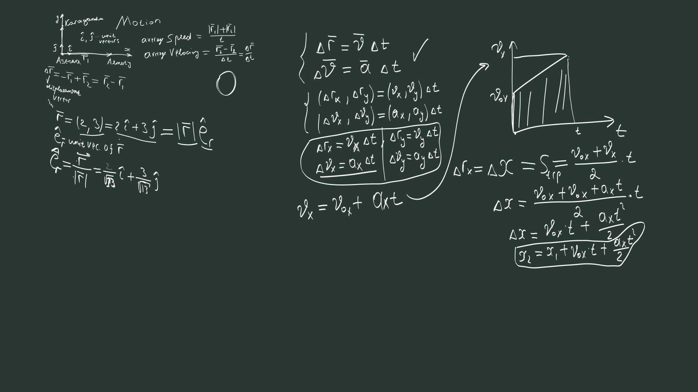
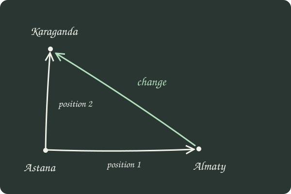
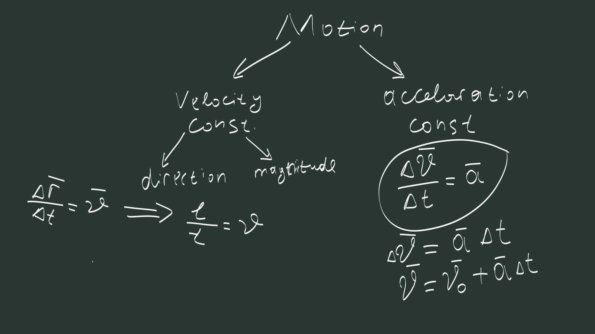
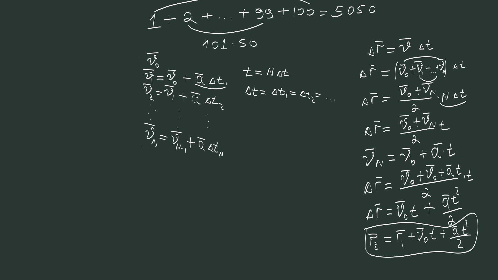
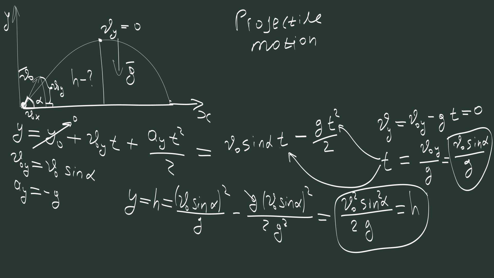
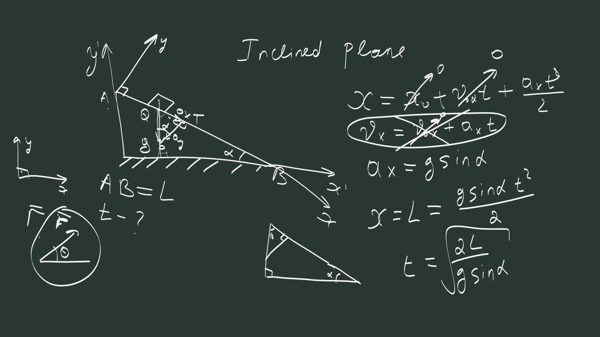

## Motion {#motion .opening}

Lecture 02 · Tilek Zhumabek

Before we can describe motion, we need to say where something is.

Position → change → time → equations of motion

Two routes to the same result: vectors first, then components.

::: {.notes}
Follow the story of the lecture, not the whiteboard export numbers. The city names are labels on an ideal flat diagram, not a geographical map. Begin with an empty space and a point. Do not introduce axes yet.
:::

## Start with one point {#origin}

01 · Position

<svg class="sketch" viewBox="0 0 1100 300" role="img" aria-label="A single point in otherwise empty space, labelled Astana, our chosen origin."><circle cx="440" cy="115" r="7" fill="#f1f3ea"/><text x="475" y="125" fill="#f1f3ea" font-size="42">Astana</text><path d="M405 210 Q415 172 435 135" stroke="#b3dfbc" stroke-width="3" fill="none"/><text x="220" y="252" fill="#b3dfbc" font-size="30">our chosen origin</text></svg>

We can give this point any name. Let us call it <em>Astana</em> and use it as our reference.

A reference point is a beginning. Directions and units still need to be chosen.

::: {.notes}
Ask students what they could call the point: a word, a number, any label. Distinguish naming a point from measuring position. Choosing an origin does not force the location of a second point. It gives us a reference relative to which we can specify that location.
:::

## “1,000 km away” is not enough {#distance}

01 · Position

<svg class="sketch" viewBox="0 0 1100 330" role="img" aria-label="A circle of candidate points at a distance of 1,000 kilometres from Astana in a plane."><circle cx="410" cy="160" r="140" fill="none" stroke="#c1d1c5" stroke-width="2" stroke-dasharray="7 9"/><circle cx="410" cy="160" r="6" fill="#f1f3ea"/><path d="M410 160 L550 160" stroke="#b3dfbc" stroke-width="3"/><g fill="#f1f3ea"><circle cx="550" cy="160" r="6"/><circle cx="410" cy="20" r="6"/><circle cx="270" cy="160" r="6"/><circle cx="410" cy="300" r="6"/></g><g fill="#f1f3ea" font-size="27"><text x="365" y="199">Astana</text><text x="422" y="145">1,000 km</text><text x="630" y="140">Which point?</text><text x="630" y="183" fill="#b3dfbc">Infinitely many choices.</text></g></svg>

Distance fixes a circle in a plane. We still need a direction.

In three-dimensional space, the same distance gives a sphere.

::: {.notes}
Keep the idealisation explicit: 1,000 km is an illustrative instruction, not a measured distance between the actual cities. On our two-dimensional board the set is a circle. In three dimensions it is a sphere. Adding a complete direction singles out one point.
:::

## Add a direction: a position vector {#position-vector}

01 · Position

“1,000 km <em>in this direction</em>.”

Now we have one endpoint. Call it <em>Almaty</em>.

Origin → point = position vector

Locate Karaganda in the same way: another arrow from the same origin.

The city names label a schematic plane. We return to the drawn axes later.

::: {.notes}
Use the direction towards Almaty to complete the instruction. Emphasise magnitude AND direction. The original sketch includes unit-vector symbols; leave those for the component part. A position vector depends on the chosen origin.
:::

## Displacement: what changed? {#displacement}

02 · From position to motion

Finish minus start.

The new arrow runs from the old position to the new position.

To describe motion, ask how position changes <em>with time</em>.

::: {.notes}
Compare two positions measured from the SAME fixed origin. The displacement runs from the initial point to the final point, not from Astana unless the motion starts there. A shifted fixed origin changes both position vectors equally, so their difference stays the same. Introduce average velocity as displacement divided by elapsed time; motion means a changing position relative to this reference frame.
:::

## Two familiar kinds of motion {#types}

Constant velocity keeps the whole arrow fixed. Constant acceleration changes the velocity arrow at a fixed rate.

::: {.notes}
Recall the two cases known from school. Constant acceleration includes zero acceleration as a special case; the branches organise the discussion, not disjoint categories. Constant speed alone does not imply constant velocity, since direction can change.
:::

## Constant velocity: remember the direction {#constant-velocity}

The direction stays fixed. The magnitude stays fixed.

Choose a line along the motion. Now one number is enough.

$$\Delta\vec r=\vec v\,\Delta t
\qquad\Longrightarrow\qquad
\Delta x=v_x\,\Delta t.$$

Along the direction of travel, distance = speed × time. A signed coordinate still records which way is positive.

::: {.notes}
We have not discarded direction: we stored it in the choice of axis. For nonzero constant velocity along the positive axis, speed equals the positive component. The familiar l/t rule concerns distance and speed. Average velocity equals instantaneous velocity in this constant case.
:::

## Constant acceleration: equal changes {#constant-acceleration}

Equal time intervals give equal <em>vector changes</em> in velocity.

But what is the total displacement?

Constant means both the magnitude and the direction of acceleration stay fixed.

::: {.notes}
Take t = 0 at the start, so elapsed time is t. The first target is v(t) = v0 + a t. Do not claim that the direction of velocity must be fixed: projectile motion is the coming counterexample. The second target is the position equation, using vector arithmetic.
:::

## A familiar sum {#pairing}

03 · Derive the equations with vectors

How did you get 5,050?

First + last. Second + second-last. Every pair has the same sum.

Can we use the same idea for changing velocities?

::: {.notes}
Let students supply 50 pairs of 101. The connection is an arithmetic sequence: equal time increments with constant vector acceleration give equal vector increments. We can pair vectors using the same addition laws.
:::

## Equal times, an arithmetic sequence {#velocity-sequence}

$$t=N\delta t,$$
$$\vec v_j=\vec v_0+j\vec a\,\delta t.$$

There are $N$ intervals and $N+1$ boundary velocities.

Each step adds the same vector.

Pair equal-time velocities from opposite ends: their sum is always $\vec v_0+\vec v_N$.

::: {.notes}
Explicitly distinguish the boundary index j = 0,...,N from the N time intervals. This avoids the N-versus-N+1 ambiguity in the original board. Pairing works component-free because vector addition and multiplication by numbers obey the same distributive rules.
:::

## One interval needs its average velocity {#interval-average}

03 · Make the sum exact

$$\vec u_j=\frac{\vec v_j+\vec v_{j+1}}{2},
\qquad
\Delta\vec r_j=\vec u_j\,\delta t.$$

$$\vec u_0+\vec u_{N-1}=\vec v_0+\vec v_N.$$

$$\Delta\vec r
=\left(\vec u_0+\cdots+\vec u_{N-1}\right)\delta t
=\frac{\vec v_0+\vec v_N}{2}\,N\delta t.$$

Under constant acceleration, velocities at equal times on either side of an interval’s midpoint pair to the same sum. Its average is the mean of its endpoint velocities.

::: {.notes}
This is the precision needed in the spoken derivation. An instantaneous velocity times a finite interval is generally not that interval's exact displacement. Use its average velocity u_j. Since velocity changes linearly in time, symmetric moments have equal velocity sums; their time average is the midpoint velocity, the mean of the endpoints. There are exactly N averages. Pair from opposite ends, or write the sequence twice in reverse order; either works for odd and even N. No components or integration are needed.
:::

## The vector equations of motion {#vector-equations}

Substitute the final velocity:

$$\vec v(t)=\vec v_0+\vec a\,t.$$

Then add the starting position:

$$\vec r(t)=\vec r_0+\vec v_0t+\frac12\vec a\,t^2.$$

Two vector equations. One assumption: constant acceleration.

::: {.notes}
The original board labels initial and final position r1 and r2; the notes use r0 and r(t). These mean the same endpoints. We achieved the first goal entirely with vector arithmetic. Now ask how to calculate using only signed numbers.
:::

## Fix directions before using numbers {#choose-axes}

04 · Derive the equations with components

Choose two perpendicular directions in our plane.

Fix $\hat{\imath}$ and $\hat{\jmath}$. Then keep their directions fixed.

An arrow = an x-part + a y-part.

Two independent directions span a plane. General three-dimensional motion needs a third, $\hat{k}$.

::: {.notes}
Clarify the spoken statement: a vector can be split into two vectors in many ways, but two FIXED directions cannot represent every vector in 3D. We work in a plane with perpendicular axes. Actual city bearings are not generally perpendicular: these names are schematic labels. Non-perpendicular basis vectors are possible, but the simple square-root magnitude formula would change.
:::

## Three ways to write the same vector {#unit-vectors}

Components: $(2,3)$

Fixed directions: $2\hat{\imath}+3\hat{\jmath}$

Length × its own direction: $|\vec r|\hat e_r$

$$|\vec r|=\sqrt{13},
\qquad
\hat e_r=\frac{\vec r}{|\vec r|}
=\frac{2}{\sqrt{13}}\hat{\imath}
+\frac{3}{\sqrt{13}}\hat{\jmath}.$$

A unit vector has length 1. The zero vector has no defined direction to normalise.

::: {.notes}
Treat 2 and 3 as component numbers in the same chosen length unit. Distinguish the fixed basis vectors i and j from e_r, which points along this particular position vector and can change as the object moves.
:::

## Two vector equations become four scalar equations {#components}

$$v_x=v_{0x}+a_xt,$$
$$v_y=v_{0y}+a_yt,$$

$$x=x_0+v_{0x}t+\tfrac12a_xt^2,$$
$$y=y_0+v_{0y}t+\tfrac12a_yt^2.$$

For displacement over an interval, the velocity in $\Delta x=\bar v_x\Delta t$ is an average. The same applies to y.

::: {.notes}
The original board's displacement component uses a v symbol without an explicit average bar; state this qualification. Equal vectors have equal coefficients along each fixed independent basis direction. Two vector equations correspond to four scalar equations in 2D, or six in 3D. Components can be negative; these are signed numbers, not just magnitudes.
:::

## Derive it again, one direction at a time {#scalar-derivation}

A straight line: its signed area is a trapezoid.

Use $\bar v_x=(v_{0x}+v_x)/2$, then $v_x=v_{0x}+a_xt$. Repeat for y.

::: {.notes}
This is the second derivation, now using only scalar values. Explain the graph as a picture of adding equal-time contributions, not a new law. Area below the axis contributes negatively. If the line crosses zero, combine signed areas. The drawn example stays above zero. Match the resulting scalar equations to the components of our vector result.
:::

## Apply it: projectile motion {#projectile .application}

Neglect air resistance; g is constant. Set the launch point at y = 0. At the top, $v_y=0$; the horizontal velocity generally remains nonzero.

::: {.notes}
Choose x horizontal and y upwards. Initial velocity components are v0 cos alpha and v0 sin alpha; ax = 0, ay = -g. Start from the component equations already derived. Set vy = 0 to find time to the top, then substitute that time into y(t). The result is height above launch, h = v0² sin² alpha / (2g), for an upward launch. No new kinematic formula is required.
:::

## Apply it: an inclined plane {#incline .application}

A block slides from rest on a straight, frictionless, fixed incline; $0<\alpha<90^\circ$. The normal force cancels the perpendicular component of gravity: $a_x=g\sin\alpha$.

::: {.notes}
Rotate the coordinate directions to fit the problem. Take x downhill and y perpendicular to the plane. The acceleration formula requires the force model: gravity plus a normal reaction, with no friction or other applied forces. Gravity alone would accelerate the block through the surface; the normal reaction enforces the constraint. For length L and initial speed zero, L = (1/2) g sin alpha t², so choose the positive square root. Rotation of axes does not change the vector laws.
:::

## One story, two descriptions {#recap}

Position Choose a reference. Give a distance and a direction.

Motion Compare positions. Keep track of elapsed time.

Vectors Pair equal-time velocities. Derive two equations.

Components Fix axes; use signed numbers. Apply the same equations.

$$\vec v=\vec v_0+\vec a\,t,
\qquad
\vec r=\vec r_0+\vec v_0t+\tfrac12\vec a\,t^2.$$

These forms require constant acceleration. Changing the axes changes the components, not the motion.

[Read the explanations and worked examples →](index.html)

::: {.notes}
Check the two goals: can students reconstruct the pairing argument without components, and then derive the same result along one fixed axis? Ask why zero vertical velocity at the projectile's peak does not mean zero acceleration. Ask which incline assumption would fail if friction were added.
:::
