::: {.lecture-links}
[Open the lecture slides](slides.html){.button .primary}
[All lectures](../../index.html){.button .secondary}
:::

::: {.lesson-intro}
**Vectors appear throughout physics. Our goal is to use them to describe motion.**
In mechanics we use displacement and velocity vectors. Electricity and magnetism
also use vectors. In quantum mechanics, a **state vector** helps predict the chances of different measurement results.
In general relativity, **velocity vectors** describe motion through space and time.
These examples show how widely the idea is used; they are not extra topics to
learn today. Our calculations begin with the arrows that describe everyday motion.

For our kinematics work, **vector arithmetic and algebra are enough**: adding,
subtracting, and calculating with components and ordinary numbers. The
parallelogram rule and familiar arithmetic laws explain how the tools work.
:::

::: {.idea}
**Two parts**

**Part 1 · Introduction to vectors.** A short introduction to what the arrows
represent and how components describe them. This prepares the tools.

**Part 2 · Apply addition and subtraction.** This is the main lesson. We give
equal time and space to **combining motions** and **finding changes**, including
practice in each. Other vector methods are outside this course's kinematics work.
:::


::: {.idea}
**Four goals**

1. **Add two vectors** and explain what their sum represents.
2. **Calculate with components** using ordinary arithmetic and the distributive rule.
3. **Subtract two vectors** and explain the size and direction of the difference.
4. **Use a change to describe motion**: find displacement, average velocity, or average acceleration.

We will return to these same four goals at the end. Questions at any step are welcome.
:::


## Part 1 · Introduction to vector {#what-makes-a-vector}

We start by learning what an arrow represents and how to describe it with
components. Once that is clear, we can learn to combine arrows, check what
the combination means, and use familiar arithmetic to calculate with them.

### Start with size and direction

You may have learned that a vector is “a quantity with a size and a direction”.
That is a useful starting point. A displacement of **5 km towards the river**
tells us both how far the finish is from the start and which way it lies.

We draw a displacement as an arrow. The starting end is the **tail**; the pointed
end is the **tip**. The arrow's length represents the size, using a scale we choose.

A **scalar** needs no direction: mass, time, temperature, and distance travelled
are examples. A **vector**, such as displacement or velocity, needs a direction
as well as a size. But we also need to check how it combines with other quantities
of the same kind.

### Two descriptions of the same displacement

Aida says, “5 km towards the river.” Baurzhan says, “3 km east and 4 km north.”
If the river is at that endpoint, both describe the same **displacement**.

The pair of numbers $(3,4)$ gives its **components** along east and north.
The diagonal has length $\sqrt{3^2+4^2}=5$ km.
If we turn our coordinate axes, the component numbers change, but the displacement
from the start to the river does not.

The routes can differ: someone walking east and then north travels 7 km, while
someone taking the diagonal travels 5 km. The displacement is the same because
their start and finish are the same.

::: {.bridge}
We can now read an arrow and tell a vector from its component description.
Now we can ask how the two component arrows combine into the whole displacement.
That takes us to addition: first the drawing, then what its answer means.
:::

## Part 2A · Addition: combine motions {#what-addition-means}

Our first main question is **what happens when motions combine?** A swimmer
moves across a river while the current carries them downstream. We need to
combine those two velocity vectors to describe the motion seen from the bank.

### Draw the sum

To add two displacement arrows, put the second arrow's **tail at the first arrow's
tip**. Keep both lengths and directions unchanged.
The sum runs from the first tail to the final tip. This sum is also called the
**resultant**.

```{=html}
<figure class="diagram">
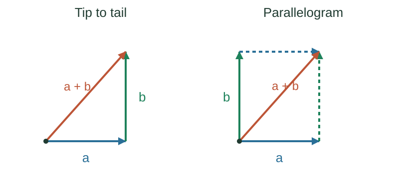
<figcaption>Two constructions, one answer: the coral arrow runs from the overall start to the finish.</figcaption>
</figure>
```

You can draw the same addition as a **parallelogram**. Start the arrows at the
same point, complete the two parallel sides, and draw the diagonal from their
shared tail. Moving one arrow to the tip of the other shows why both drawings agree.

::: {.bridge}
We now know how to draw a sum. But does that diagonal always describe what
happens in the physical situation? The hunters' story tests that question.
:::

### Why the hunters' arrows do not combine

Banesh Hoffmann tells a story in *About Vectors* about hunters who thought that
their arrows were vectors. They saw a deer to the north-east. Instead of aiming
at it, they fired one arrow east and another north, then waited for the arrows
to add together. The story ends with the joke that no trace of the hunters was
ever found.

The point is physical. **Two arrows in flight remain two separate objects.**
Neither changes course to follow the diagonal just because we add the two
velocity arrows on paper.

In a walk, successive displacements describe one person's overall change of
position. For a swimmer, their velocity relative to the water and the water's
velocity relative to the bank describe one swimmer's motion relative to the bank.

We can add vectors mathematically, but we must explain **what that sum represents**.
Adding two velocities does not mean that two objects merge into one.

::: {.idea}
**An arrow drawing is useful when its operations match the physical question.**
First say what the arrows represent. Then say what their sum means.
:::

::: {.bridge}
The hunters combined velocities belonging to two separate moving objects.
For the swimmer, two velocity contributions describe one motion seen from
the bank. Let us see why the sum answers that question.
:::

### Where you already add vectors

For the swimmer, the two arrows have a clear relationship: one describes
motion through the water, and the other describes the water moving past the bank.

A swimmer aims straight across at 4 m/s relative to the water while the current carries them
downstream at 3 m/s. Relative to the bank, the swimmer moves at 5 m/s, at an
angle to the crossing.

```{=html}
<figure class="diagram">
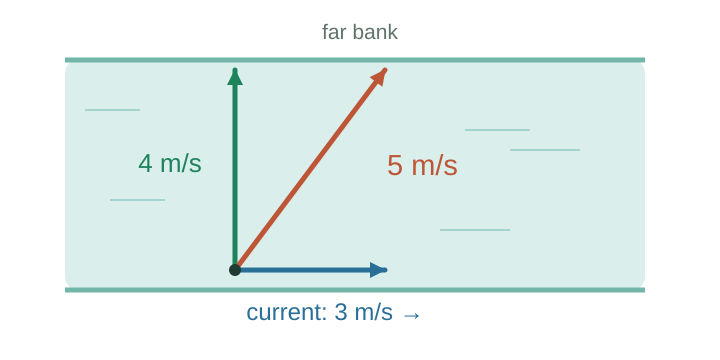
<figcaption>The two parts are perpendicular, so the resultant is the diagonal: a 3-4-5 triangle.</figcaption>
</figure>
```

An aeroplane flying in a crosswind is the same picture: the plane's velocity
relative to the air, plus the air's velocity relative to the ground, gives the
plane's velocity relative to the ground. Two people pushing a box from different
sides is the same picture again, with forces instead of velocities.

Learn the drawing once and you can answer all three.

| Situation | What the addition describes |
|---|---|
| Successive displacements of one person | The person's overall displacement. |
| A swimmer's velocity and a river current | The swimmer's velocity relative to the bank. |
| Several forces on one body | The resultant force on that body. |
| Two arrows flying separately | Their velocity sum does not give either arrow's actual velocity. |

::: {.bridge}
We have a drawing and a physical meaning for its answer. How do we calculate
with the parts? Start with two familiar arithmetic rules: changing the order
of addition, and multiplying a sum. The apples show both in one place.
:::

### Three bags of apples: order and grouping

Imagine three bags, each containing two red apples and three green apples.

**Order:** count red then green, or green then red. Each bag still has five
apples: $2+3=3+2$.

**Grouping:** count bag by bag: $3(2+3)=15$ apples.
Or count all the red apples, then all the green apples: $3\times2+3\times3=15$.

This is the **distributive rule**: multiplying a sum gives the same result as
multiplying each part and then adding.

```{=html}
<figure class="diagram">
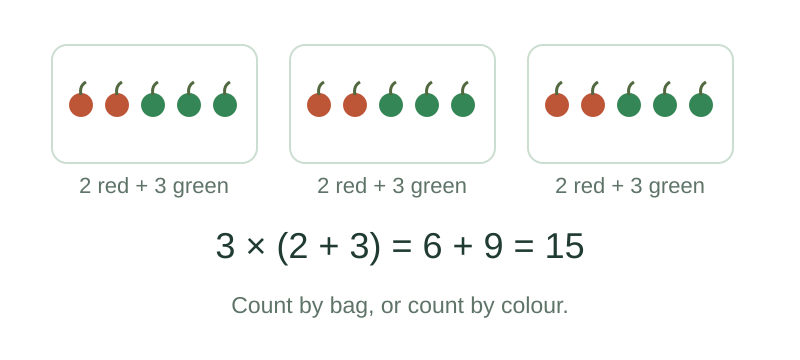
<figcaption>Counting by bag or counting by colour changes the organisation, not the total.</figcaption>
</figure>
```

**The order rule also works for displacement vectors.** Walk 3 km east and
then 4 km north, or take those same steps in the reverse order. You reach the
same finish. In symbols,

$$\mathbf{a}+\mathbf{b}=\mathbf{b}+\mathbf{a}.$$

```{=html}
<figure class="diagram">
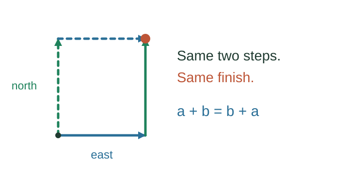
<figcaption>Just as changing the counting order leaves the apple total unchanged, changing the order of these steps leaves the finish unchanged.</figcaption>
</figure>
```

We will use both rules to calculate with vector components. First, check an
important limit: size and direction alone do not guarantee the order rule.

### Challenge the order rule with a book

The apples and the walk give the same result when we reverse the order.
Does every quantity with a size and a direction behave that way?

Now pick up a book. A turn has an angle and an axis: it seems to have a size and
a direction too. Does it obey the same addition rule?

1. Choose a vertical axis and a horizontal axis through the book's centre.
   Keep both axes fixed relative to the room.
2. Turn the book 90° about the vertical axis, then 90° about the horizontal axis.
3. Return the book to its original position.
4. Repeat the same turns, in the same senses, but in the reverse order.

```{=html}
<figure class="diagram">
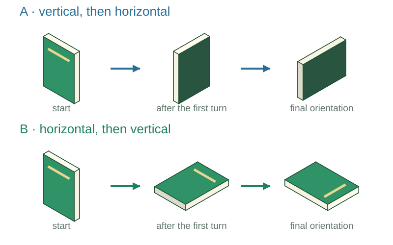
<figcaption>The cover is green and the pages are pale. Follow the same book through both sequences.</figcaption>
</figure>
```

The book ends in different orientations. These two turns do **not**
combine like displacement vectors. We cannot treat their combination as ordinary
vector addition just because we can assign each turn an angle and an axis.

::: {.idea}
**Size and direction are a start. A vector must also obey vector addition rules.**
The book gives us a way to test that distinction, rather than just memorise it.
:::

::: {.bridge}
The book turns fail the order rule. Displacement vectors obey it, so we can
rearrange steps without changing the finish. Now return to the apples' other
rule: does multiplying each part give the same displacement as repeating the whole?
:::

### Back to walks: multiply the whole or the parts

Suppose $\mathbf{a}$ is an eastward step and $\mathbf{b}$ a northward step.
Repeat the pair three times. You reach the same endpoint as someone who takes
three eastward steps and then three northward steps.

```{=html}
<figure class="diagram">
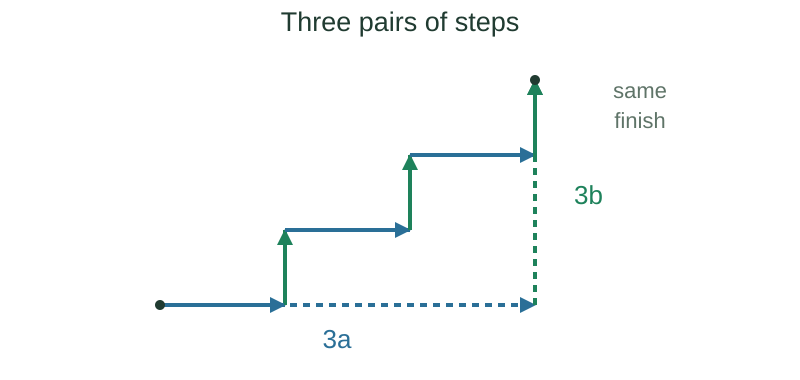
<figcaption>The paths differ, but the overall displacement is the same: 3(a + b) = 3a + 3b.</figcaption>
</figure>
```

We can rearrange three pairs of steps into three eastward steps followed by
three northward steps because their addition order does not change the finish.
The order rule and the distributive rule work together:

$$n(\mathbf{a}+\mathbf{b})=n\mathbf{a}+n\mathbf{b}.$$

Here $n$ is an ordinary number. Multiplying a vector by 3 makes it three times
as long, with the same direction. Multiplying by −1 reverses its direction.

The rule tells us that a vector can be split into components **without changing
the result of scaling and adding it**. We can work with one component at a time.

### Use components to calculate a motion

For an object moving at **constant velocity** $\mathbf{v}$, its displacement
during a time $t$ is $\mathbf{v}t$.
Write its velocity as an eastward part $\mathbf{v}_x$ plus a vertical part
$\mathbf{v}_y$. Then

$$\mathbf{v}t=(\mathbf{v}_x+\mathbf{v}_y)t
=\mathbf{v}_x t+\mathbf{v}_y t.$$

The left side uses the whole velocity. The right side finds the displacement in
each direction and adds the results. The distributive rule makes these two
calculations agree. The units also work: metres per second multiplied by seconds
gives metres.

Both parts use the **same elapsed time**. They describe two components of one
motion, not two separate journeys with different clocks.

### Apply it to a falling object

For a bullet fired horizontally, the vertical velocity is not constant: gravity
changes it. We therefore cannot describe the entire flight by multiplying the
initial velocity by time.

We can still resolve the motion into horizontal and vertical components.
With **constant downward gravity and no air resistance**, gravity changes only
the vertical component. Taking horizontal distance $x$ and downward distance
fallen $y$ as positive, with both measured from the launch point,

$$x=v_{0x}t,\qquad y=\tfrac12gt^2.$$

Here $v_{0x}$ is the initial horizontal speed, $g$ is the downward acceleration,
and the initial vertical speed is zero.
The horizontal speed does not appear in the falling equation.

This explains the two-bullet experiment. Fire one bullet horizontally and drop
another from the same height at the same instant.
They start with the same vertical speed, experience the same vertical acceleration,
and fall the same distance to level ground. **They land together in this model.**

```{=html}
<figure class="diagram">
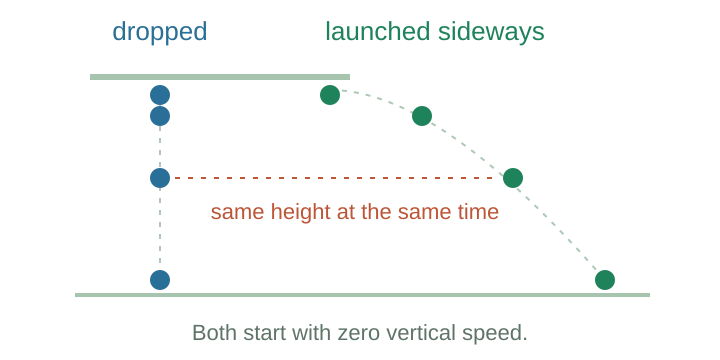
<figcaption>The same argument works with balls. The dotted line compares their heights at one shared time.</figcaption>
</figure>
```

::: {.idea}
**Two ingredients work together.**
Vector algebra lets us split and recombine the motion. The physical assumptions
make the horizontal and vertical equations independent here. Both describe
the same time interval.
:::

If we increase the horizontal speed, the bullet travels farther before landing,
but its falling time stays the same under these assumptions.
That is the reasoning we will use in the first worked problem.

::: {.bridge}
We have connected the drawing to component arithmetic and the physical equations
for motion. Try that method now: find a shared time, calculate each part, and
explain the combined result. The two examples use the same organisation.
:::

### Practise addition and components {#addition-practice}

Try each question before opening its solution. For the falling example, use
$g=10$ m/s², constant gravity, and no air resistance.

#### 1. A bullet fired sideways

A bullet leaves a rifle horizontally at 100 m/s from 45 m above level ground.
How long is it in the air, and how far horizontally does it travel?

<details>
<summary>Show the solution · sideways flight</summary>

::: {.answer}
**First find the time from the falling motion.** Its initial vertical speed is
zero, so $45=\tfrac12(10)t^2$. This gives $t^2=9$, hence **$t=3$ s**.

**Then use the same time horizontally.** The horizontal speed stays constant,
so $x=100\times3=\mathbf{300}$ m.

The horizontal speed never entered the falling equation. A bullet simply dropped
from this height also lands in 3 s. Firing at twice the horizontal speed would
double the horizontal distance, not change that time.
:::

</details>

#### 2. Crossing a river

A river is 100 m wide and flows steadily downstream at 3 m/s.
You swim at 5 m/s relative to the water, aiming straight across throughout.
How long is the crossing, how far downstream do you land, and what is your
speed relative to the bank?

<details>
<summary>Show the solution · the river</summary>

::: {.answer}
**Across the river:** $t=100/5=\mathbf{20}$ s.
The current has no component across the river, so it does not change this time.

**Downstream:** $x=3\times20=\mathbf{60}$ m.
This uses the same 20 seconds.

**Speed relative to the bank:** the across and downstream components are
perpendicular, so the speed is $\sqrt{5^2+3^2}=\sqrt{34}\approx\mathbf{5.8}$ m/s.

This uses the same method as the projectile problem: solve the motion in one
direction to find the time, then use that time in the other direction.
The physical equations differ, but the organisation is the same.
:::

</details>


::: {.idea}
**Addition checkpoint:** you can combine velocity arrows and calculate the
motion one direction at a time. The parallelogram rule joins the parts; the
distributive rule explains why the component calculations agree.
:::

::: {.bridge}
Now change the question. Instead of asking how two motions combine, suppose we
know a motion before and after a turn. We want the difference between them.
Subtraction finds that difference using the addition rule we already know.
We will give it the same attention: a drawing, component arithmetic, and practice.
:::

## Part 2B · Subtraction: find changes {#subtracting-vectors}

Our second main question is **what changed?** A position changes during a walk.
A velocity changes when a car speeds up, slows down, or turns. Subtracting the
two vectors tells us both the size and direction of that change.

### Subtraction uses the addition rule too

We already know how to combine arrows. Subtraction asks for the arrow that
connects a known starting value to a known final value.

If the starting vector is $\mathbf{b}$ and the final vector is $\mathbf{a}$,
we want an arrow $\mathbf{c}$ for which $\mathbf{b}+\mathbf{c}=\mathbf{a}$.
So $\mathbf{c}=\mathbf{a}-\mathbf{b}$.

There are two equivalent ways to draw it:

1. **Add the reversed vector.** Keep the length of $\mathbf{b}$, reverse its
   direction to get $-\mathbf{b}$, then add it to $\mathbf{a}$ tip to tail.
2. **Put the tails together.** Draw the two original arrows from the same
   point, then draw from the tip of $\mathbf{b}$ to the tip of $\mathbf{a}$.

```{=html}
<figure class="diagram">
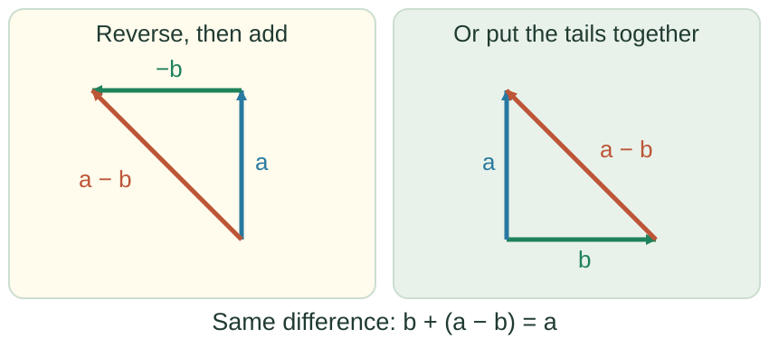
<figcaption>The same addition rule gives both constructions: before + change = after.</figcaption>
</figure>
```

This is why subtracting vectors is not a separate trick:
$\mathbf{a}-\mathbf{b}=\mathbf{a}+(-\mathbf{b})$.
For a change over time, $\mathbf{a}$ is **after** and $\mathbf{b}$ is **before**.

### Use the same component arithmetic

Reversing a vector reverses both of its components. The distributive rule lets
us collect the east–west parts and the north–south parts separately. So, for a
calculation, subtract each component separately. Choose east as positive
horizontal and north as positive vertical. A car moving east at 20 m/s has
components $(20,0)$ m/s. After it turns north at 20 m/s, they are $(0,20)$ m/s.

$$\Delta\mathbf{v}=(0,20)-(20,0)=(-20,20)\ \text{m/s}.$$

The horizontal change is $0-20=-20$ m/s: westward.
The vertical change is $20-0=20$ m/s: northward.
Together they give a change towards the **north-west**.

```{=html}
<figure class="diagram">
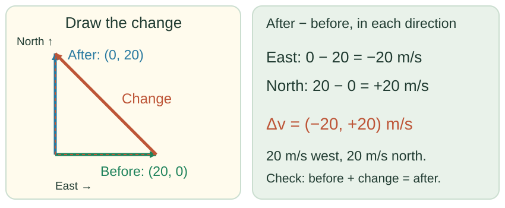
<figcaption>Ordinary subtraction in each direction gives the same answer as the arrow drawing.</figcaption>
</figure>
```

You can check the answer by adding it back:
$(20,0)+(-20,20)=(0,20)$. Before plus change really does give after.

::: {.bridge}
We can now find a change by drawing or by calculating with components. To
use it in kinematics, we also ask how much time that change took. That is
why velocity and acceleration come next.
:::

### Start with “after minus before”

For any change, take the later value minus the earlier value.
The symbol $\Delta$ (“delta”) means **change**.
For position $\mathbf{r}$,

$$\Delta\mathbf{r}=\mathbf{r}_2-\mathbf{r}_1.$$

This displacement divided by the elapsed time $\Delta t$ gives the **average
velocity**. The change in velocity divided by that same elapsed time gives the
**average acceleration**:

$$\mathbf{v}_{\mathrm{avg}}=\frac{\Delta\mathbf{r}}{\Delta t},
\qquad
\mathbf{a}_{\mathrm{avg}}=\frac{\Delta\mathbf{v}}{\Delta t}.$$

These are vector differences, so direction matters.
These averages describe the chosen time interval. For now, the method is
**find the vector change, then divide by the time taken**.

::: {.bridge}
A straight-line change is easy to see. A turn is a useful next test: the speed
can stay the same while the velocity changes. The drawing will show what a
speed reading alone misses.
:::

### Try the turning-car question

A car drives around a circle at a steady 5 m/s. Is it accelerating?

The speed has not changed. But **velocity includes direction**, and the car's
direction keeps changing. We need to subtract its velocity arrows, rather than
subtract the two speed readings.

1. Draw a circle and mark two nearby positions of the car.
2. At each position, draw the velocity along the **direction of travel**, at right angles to the radius.
3. Copy both arrows to an empty part of the page so their **tails meet**.
   Do not rotate or resize them.
4. Draw from the tip of the first velocity to the tip of the second.
   This is $\Delta\mathbf{v}=\mathbf{v}_2-\mathbf{v}_1$.

```{=html}
<figure class="diagram">
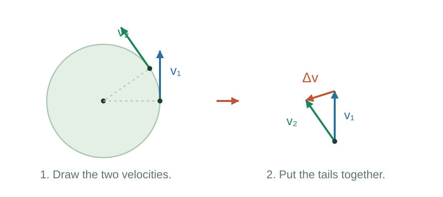
<figcaption>First draw the motion. Then move the velocity arrows, unchanged, so you can compare them.</figcaption>
</figure>
```

The difference is **not zero**, so the car is accelerating. Dividing that
change by the time between the two moments gives its average acceleration.
The subtraction reveals a change that the speed readings alone did not show.

::: {.idea}
**Same speed does not mean same velocity.**
Equal arrow lengths can still have different directions.
:::

### Turning and changing speed

The car changed direction without changing speed. What would be different if
it also sped up? To separate these effects, describe acceleration relative to
the current velocity:

- The component **along the velocity** changes the speed. In the same direction
  it speeds the object up; in the opposite direction it slows the object down.
- The component **perpendicular to the velocity** changes the direction.

```{=html}
<figure class="diagram">
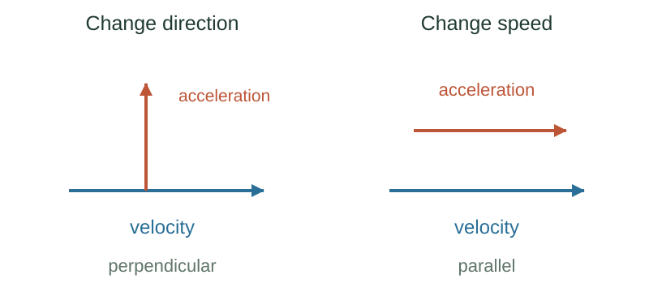
<figcaption>These describe acceleration at a moment. A change measured over a whole turn need not be at right angles to the starting velocity.</figcaption>
</figure>
```

In circular motion at constant speed, the acceleration is perpendicular to the
velocity and points towards the centre. This helps us understand
why steering changes a car's velocity even when its speed stays steady.

Before trying another use of subtraction, check one detail of our drawing:
which tip did we start from?

### Why the subtraction order matters

Addition gives the same result in either order, but subtraction does not:

$$\mathbf{a}+\mathbf{b}=\mathbf{b}+\mathbf{a},\qquad
\mathbf{a}-\mathbf{b}=-(\mathbf{b}-\mathbf{a}).$$

The minus sign reverses the direction of a vector.
If we draw from the second velocity's tip to the first, we get the negative of
the change we wanted. For a change over time, label the arrows **before** and
**after**, then subtract after minus before.

::: {.bridge}
So far we compared the same object's velocity at two times. The same subtraction
also compares an object with a moving observer. Rain gives us a familiar way
to see this use of the rule.
:::

### Rain: changing the observer

Suppose rain falls straight down relative to the ground.
A person standing still sees that downward velocity. Someone running horizontally
sees the rain moving diagonally towards them.

To find a velocity relative to a moving observer, subtract the observer's
velocity. Measure both velocities on the right relative to the ground:

$$\mathbf{v}_{\text{rain relative to you}}
=\mathbf{v}_{\text{rain relative to ground}}
-\mathbf{v}_{\text{you relative to ground}}.$$

The rain's ground velocity has not changed. **The observer has changed.**
Subtracting a rightward running velocity adds a leftward component to the rain's
velocity as seen by the runner. Run faster and the rain appears more slanted.

A turn showed a change of direction without a change of speed. A bounce takes
that idea further: the direction reverses completely. We can check it with
ordinary signed numbers.

### A ball bouncing off a wall

Choose right as positive. A ball approaches the wall at $+8$ m/s and rebounds
at $-8$ m/s. Its change in velocity is

$$\Delta v=-8-(+8)=-16\ \text{m/s}.$$

Its speed is 8 m/s before and after, so the change in speed is zero.
Its velocity changes by **16 m/s to the left**.

If the ball stops instead, its change is $0-(+8)=-8$ m/s.
The rebound changes the velocity by twice as much as stopping. We found both changes
using the same rule: after minus before.

The same care is needed with position: a long journey can end where it began.
That gives us one final check on what a vector difference measures.

### Distance and displacement answer different questions

After one lap of a 400 m track, the distance travelled is 400 m, while the
displacement is zero. If the lap takes 100 s, the average speed is $400/100=4$ m/s,
but the average velocity is zero because the start and finish coincide.

A zero average velocity over the lap does not mean the runner was stationary.
It tells us about the net displacement over that whole interval.

::: {.bridge}
We have used differences to compare positions, velocities, and observers.
Now try the method yourself: identify what is being compared, subtract in the
right order, and explain the direction of the result.
:::

### Practise subtraction and change {#subtraction-practice}

#### 3. A car turning a corner

A car initially travelling east at 20 m/s turns and travels north at 20 m/s.
The turn takes 4 s. Find its change in velocity and its average acceleration.

<details>
<summary>Show the solution · the corner</summary>

::: {.answer}
**Draw the velocities tail to tail.** Both have length 20 m/s and the angle
between them is 90°. The difference runs from the eastward tip to the northward tip.

**Find its length:** $|\Delta\mathbf{v}|=\sqrt{20^2+20^2}=20\sqrt2
\approx\mathbf{28.3}$ m/s. It points **north-west**.

**Divide by the time:** the average acceleration has magnitude
$28.3/4\approx\mathbf{7.1}$ m/s², also north-west.

The change in speed is zero. The change in velocity is not.
This is the average acceleration over the whole turn, not a claim that the
instantaneous acceleration points north-west throughout.
:::

</details>

#### 4. A walk

You walk 3 km east, 4 km north, then 3 km west.
Call your starting point $(2,1)$ km on an east–north map. What is your final
position, your displacement, and the distance you walked?

<details>
<summary>Show the solution · the walk</summary>

::: {.answer}
**Final position: $(2,5)$ km.** The eastward and westward steps cancel; the
north coordinate increases by 4 km.

**Displacement: 4 km north.** Subtract start from finish:
$(2,5)-(2,1)=(0,4)$ km. We get the same displacement even though the start
was not the origin of the map.

**Distance: 10 km.** Add the lengths of all three parts: $3+4+3=10$ km.

The displacement describes the start and finish. The distance describes the
route taken between them.
:::

</details>


::: {.idea}
**Subtraction checkpoint:** you can find a difference by drawing or by subtracting
components. For a change over time, use after minus before. Divide by the elapsed
time when you need an average velocity or average acceleration.
:::

## Finish · Return to our four goals {#check-your-reasoning}

The two main questions now have different, useful answers:
**addition combines parts; subtraction compares values.** Both use the same
arrow rules and ordinary arithmetic.

| Our goal at the start | What you have put into practice |
|---|---|
| **Add two vectors** | Use tip-to-tail or the parallelogram and explain the sum: the swimmer and current. |
| **Calculate with components** | Work one direction at a time, then recombine: the apples, falling object, and river crossing. |
| **Subtract two vectors** | Add a reversed vector, or compare tips with tails together: the turning car and rain. |
| **Use a change to describe motion** | Subtract positions or velocities, then divide by time when needed: the walk, the lap's average velocity, and the car's average acceleration. |


[Return to the lecture slides →](slides.html)

[Next lecture: Motion — from a position to the equations of motion →](../motion/index.html)

::: {.further-reading}
The hunters' story is adapted from Banesh Hoffmann's *About Vectors* (Dover, 1975).
For another explanation of components and vector addition, see
[Feynman's chapter on vectors](https://www.feynmanlectures.caltech.edu/I_11.html).
:::
