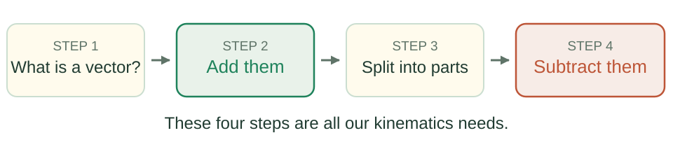

## Vectors {#vectors .cover background-color="#174a38"}

```{=html}
<p class="eyebrow">LECTURE 01 · TILEK ZHUMABEK</p><div class="cover-copy"><p>Adding and<br>subtracting arrows.</p><p class="small-note">Vectors are everywhere in physics.<br>Today we need only two operations on them:<br><strong>add</strong> and <strong>subtract</strong>.</p><p class="cover-path">Add → Split into parts → Subtract</p></div>
```

::: {.notes}
Open by promising something small and finishing it. Say out loud: today has two operations, addition and subtraction, and both come from one rule they already know. Keep the book demonstration and the live tail-to-tail construction. All four problems remain.
:::

## You already use vectors {#everywhere}

```{=html}
<p class="eyebrow">01 · WHY THIS MATTERS</p><div class="deck-art full"></div><div class="takeaway">A vector is any quantity with a size and a direction that we combine with another one of the same kind.</div>
```

::: {.notes}
Ask the students for one more example before showing the slide. Walking directions, wind, forces, a thrown ball. Keep it concrete and local. The message is that this is an everyday idea, not an exotic one. Do not name advanced topics here.
:::

## What you will be able to do today {#todays-goal}

```{=html}
<p class="eyebrow">01 · THE GOAL OF THIS LECTURE</p><div class="deck-art full"></div>
```

::: {.duo}
::: {.tile}
**What we do today**

Add. Split into parts. Subtract. No magic: it all comes from the parallelogram rule and ordinary arithmetic.
:::
::: {.tile .teal}
**What we do not need**

Other operations on vectors exist. They belong to later courses. Our kinematics needs none of them.
:::
:::

::: {.notes}
Say the goal in one sentence and write it on the board: by the end you can add two vectors, split one into parts, and subtract two vectors. Then reassure them explicitly: that is the whole list for this course. Nothing after this lecture requires more than these. Come back to this slide at the end and tick the items off.
:::

## Size and direction: a starting point {#size-and-direction}

```{=html}
<p class="eyebrow">01 · WHAT MAKES A VECTOR?</p><div class="deck-art full"></div><div class="duo"><div class="tile"><p class="label">Scalar</p><p>Mass, time, temperature.<br>A size; no direction needed.</p></div><div class="tile teal"><p class="label">Vector</p><p>Displacement, velocity, force.<br>Size, direction, and addition rules.</p></div></div>
```

::: {.notes}
Define tail and tip and choose a drawing scale. Explain that velocity means speed and direction. Introduce the question: does every quantity with a size and a direction follow the same rules? Before the book, recall that walking east then north reaches the same endpoint as north then east.
:::

## Test the definition with a book {#book-test .wide-figure}

```{=html}
<p class="eyebrow">01 · THE ORDER TEST</p><div class="deck-art full"></div><div class="takeaway">The same two 90° turns give different final orientations. Finite rotations do not add like displacement vectors.</div>
```

::: {.notes}
Do the original book demonstration slowly. Fix vertical and horizontal axes in the room through the book's centre, not axes attached to the turning book. Reset to exactly the same initial orientation before reversing the sequence. Use the same turn senses. Size and direction alone are not a sufficient definition; finite rotations about different axes generally do not commute.
:::

## Two descriptions, one displacement {#same-displacement}

```{=html}
<p class="eyebrow">01 · THE VECTOR AND ITS COMPONENTS</p><div class="deck-grid art-wide"><div class="deck-art"></div><div class="deck-copy"><p><strong>Aida:</strong> “5 km towards the river.”</p><p><strong>Baurzhan:</strong> “3 km east and 4 km north.”</p><p>Same start and finish.<br><strong>Different descriptions.</strong></p></div></div><div class="takeaway">Turn the coordinate axes: the component numbers change. The displacement does not.</div>
```

::: {.notes}
Preserve the original distinction between a vector and its description. The river must be at the stated endpoint. The two routes need not be the same: 3 + 4 is 7 km travelled along the legs; the diagonal is 5 km. The shared quantity is displacement, not the route. Define components as parts along chosen axes.
:::

## Two drawings of the same sum {#addition-rule .wide-figure}

```{=html}
<p class="eyebrow">02 · HOW ARROWS ADD</p><div class="deck-art full"></div><div class="duo"><div class="tile"><p class="label">Tip to tail</p><p>Draw from the first tail<br>to the final tip.</p></div><div class="tile teal"><p class="label">Parallelogram</p><p>Start at the shared tail<br>and draw the diagonal.</p></div></div>
```

::: {.notes}
Draw both constructions on the board and physically move the second arrow from one construction to the other. Preserve length and direction. Name the first arrow a and the second b. The same diagonal represents the sum, also called the resultant. Reversing a and b reaches the same endpoint.
:::

## The hunters' arrows {#hunters}

```{=html}
<p class="eyebrow">02 · WHAT DOES THE SUM REPRESENT?</p><p>The hunters saw a deer to the north-east. They fired one arrow east and one north,<br>then waited for the arrows to add together.</p><div class="deck-art full"></div><div class="takeaway">Two separate objects do not merge because we add their velocity arrows.</div><p class="small-note source-note">A story adapted from Banesh Hoffmann, <em>About Vectors</em>.</p>
```

::: {.notes}
Tell the original story rather than reading it. Keep the punchline: no trace of the hunters was ever found. The point is not that the mathematical sum of velocities is undefined; it is that the sum is not either arrow's trajectory. A sum must have a physical interpretation. Compare to one person's successive displacements.
:::

## Check what the arrows mean {#physical-addition}

```{=html}
<p class="eyebrow">02 · FROM A DRAWING TO PHYSICS</p><table class="deck-table"><thead><tr><th>What are we combining?</th><th>What does the sum mean?</th></tr></thead><tbody><tr><td>One person's displacements</td><td>The overall displacement</td></tr><tr><td>Swimmer + current velocities</td><td>The swimmer's velocity from the bank</td></tr><tr><td>Forces on one body</td><td>The resultant force</td></tr><tr><td>Two arrows flying separately</td><td>Not the actual velocity of either arrow</td></tr><tr><td>Finite turns about different axes</td><td>Not ordinary vector addition</td></tr></tbody></table><div class="takeaway">First identify the quantities. Then explain what combining them tells us.</div>
```

::: {.notes}
For the swimmer, use swimmer relative to water plus water relative to bank. This keeps the original argument that vector rules must match the physical question.
:::

## Where you already add vectors {#addition-in-use .wide-figure}

```{=html}
<p class="eyebrow">02 · ADDITION AT WORK</p><div class="deck-grid art-wide"><div class="deck-art"></div><div class="deck-copy"><p>A swimmer aims across at <strong>4 m/s</strong>.<br>The current carries them at <strong>3 m/s</strong>.</p><p>Relative to the bank they move at<br><strong>5 m/s</strong>, at an angle.</p><p class="small-note">The same drawing answers the plane in wind and the two people pushing a box.</p></div></div><div class="takeaway">Adding answers one question: <strong>where do the parts put us in the end?</strong></div>
```

::: {.notes}
Do the arithmetic on the board as a 3-4-5 triangle so nobody is lost in the numbers. Then say the general shape out loud: one motion relative to the water, one of the water relative to the bank, added to give motion relative to the bank. Point back to the aeroplane and the box on the opening slide so they see it is the same picture three times. This is the addition half of the lecture; subtraction gets the same amount of time later.
:::

## The order does not matter {#addition-order}

```{=html}
<p class="eyebrow">02 · A RULE WORTH CHECKING</p><div class="deck-grid art-wide"><div class="deck-art"></div><div class="deck-copy"><p>Walk <strong>3 km east</strong>, then <strong>4 km north</strong>.</p><p>Or <strong>4 km north</strong>, then <strong>3 km east</strong>.</p><p><strong>The same finish.</strong></p></div></div>
```

::: {.takeaway}
$\mathbf{a}+\mathbf{b}=\mathbf{b}+\mathbf{a}$
:::

::: {.notes}
This is the property the book failed. Say that plainly: the book had a size and a direction, but it failed this test, so it is not a vector. Displacements pass it, so they are. Keep it to one minute.
:::

## Three bags of apples {#apples}

```{=html}
<p class="eyebrow">03 · WHY WE CAN WORK WITH PARTS</p><div class="deck-art full"></div><div class="takeaway">Multiply the total in one bag, or multiply each kind and add. Both count the same 15 apples.</div>
```

::: {.notes}
Restore the original apples explanation as the starting point for distributivity. Ask students to count both ways before giving the algebra a name. Emphasise that nothing changes except how the calculation is organised.
:::

## The same rule, now with walks {#distributive-rule}

```{=html}
<p class="eyebrow">03 · THE DISTRIBUTIVE RULE</p><div class="deck-grid art-wide"><div class="deck-art"></div><div class="deck-copy"><p>Repeat the pair of steps <strong>three times</strong>.</p><p>Or take <strong>three of each step</strong>, then combine them.</p><p>Different routes.<br><strong>Same displacement.</strong></p></div></div>
```

::: {.takeaway}
$n(\mathbf{a}+\mathbf{b})=n\mathbf{a}+n\mathbf{b}$, where $n$ is an ordinary number.
:::

::: {.notes}
Explain n as a multiplier. For n = 3 it triples the length; n = −1 reverses direction. Have students say the equation in words. This rule is central to the original lecture: components can be scaled separately and recombined without changing the vector result.
:::

## Let the multiplier be a time {#time-and-components}

```{=html}
<p class="eyebrow">03 · FROM DISPLACEMENT TO MOTION</p><p>For <strong>constant velocity</strong>, displacement = velocity × elapsed time.</p>
```

::: {.formula}
$$\mathbf{v}t=(\mathbf{v}_x+\mathbf{v}_y)t
=\mathbf{v}_x t+\mathbf{v}_y t$$
:::

```{=html}
<div class="duo"><div class="tile"><p class="label">Whole motion</p><p>Multiply the complete velocity<br>by the time.</p></div><div class="tile teal"><p class="label">Its components</p><p>Multiply each velocity component<br>by that same time, then add.</p></div></div><div class="takeaway">The same distributive rule. One time interval for both parts.</div>
```

::: {.notes}
Define vx and vy as vector components along chosen perpendicular axes. The names a and b have become velocity components and the multiplier is time t. The dimensions are velocity × time = displacement. Do not apply constant v times t to the entire accelerated vertical fall; the next slide explicitly handles gravity.
:::

## Two bullets, one falling motion {#falling-components}

```{=html}
<p class="eyebrow">03 · ADD THE PHYSICAL ASSUMPTIONS</p><div class="deck-art full"></div>
```

::: {.duo}
::: {.tile}
**Horizontal:** $x=v_{0x}t$

The horizontal speed stays constant.
:::
::: {.tile .teal}
**Downward:** $y=\tfrac12gt^2$

Both start with zero vertical speed.
:::
:::

```{=html}
<p class="small-note" style="margin-top:20px">Constant gravity, no air resistance, equal starting heights, and level ground.</p>
```

::: {.notes}
Explain x and y measured from the launch point, with downward positive. Gravity accelerates both bullets vertically in the same way. Equal fall distance and equal initial vertical speed give equal landing times. Algebra permits component calculations; the physical model makes these component equations independent. Do not repeat the original overstatement that shared time alone explains the result.
:::

## What if the horizontal speed doubles? {#components-check}

```{=html}
<p class="eyebrow">03 · PAUSE AND CONNECT THE STEPS</p><p>A bullet is fired sideways from the same height, but now twice as fast.</p><div class="duo"><div class="tile"><p class="label">Question 1</p><p>Does the falling time change?</p></div><div class="tile teal"><p class="label">Question 2</p><p>What happens to the horizontal distance?</p></div></div><details><summary>Follow the reasoning</summary><div class="answer"><p><strong>The time stays the same.</strong> The vertical equation has not changed.</p><p><strong>The horizontal distance doubles.</strong> The horizontal speed doubles while the time stays the same.</p></div></details><div class="takeaway">Algebra separates and recombines the parts. Physics tells us how each part changes.</div>
```

::: {.notes}
Use the original quick-check question as a real reasoning pause. Ask where distributivity entered and why independence requires physical assumptions. Students should identify both steps, not say simply that there is one time. Keep the discussion of constant gravity and no air resistance explicit.
:::

## Subtraction is how we measure change {#measuring-change}

```{=html}
<p class="eyebrow">04 · AFTER MINUS BEFORE</p><p>Adding combines quantities. Subtracting compares them.<br><strong>Δ</strong> (“delta”) means change; <strong>Δt</strong> is the elapsed time.</p>
```

| Quantity | Vector calculation |
|---|---|
| Displacement | $\Delta\mathbf{r}=\mathbf{r}_2-\mathbf{r}_1$ |
| Average velocity | $\mathbf{v}_{\mathrm{avg}}=\Delta\mathbf{r}/\Delta t$ |
| Average acceleration | $\mathbf{a}_{\mathrm{avg}}=\Delta\mathbf{v}/\Delta t$ |

```{=html}
<div class="takeaway">Later, calculus takes the limit of these rates as the time interval becomes very small.</div>
```

::: {.notes}
Define r as position and v as velocity. The subscripts 1 and 2 mean before and after. These finite-interval rates are averages, not automatically instantaneous velocity or acceleration. The original connection to calculus stays, explained as the next step rather than a warning about difficulty.
:::

## Same speed. Is there acceleration? {#turning-question}

```{=html}
<p class="eyebrow">04 · TRY THE QUESTION BEFORE THE DRAWING</p><div class="deck-grid art-wide"><div class="deck-art"></div><div class="deck-copy"><p>A car travels around a circle<br>at a steady <strong>5 m/s</strong>.</p><p>Speed before: <strong>5 m/s</strong>.<br>Speed after: <strong>5 m/s</strong>.</p><p><strong>Has its velocity changed?</strong></p></div></div><div class="takeaway">A speed reading gives the length of the velocity arrow. We also need its direction.</div>
```

::: {.notes}
Let students state their reasoning before answering. Both vectors have equal magnitude. The direction changes. Introduce the next slide as a way to see the difference rather than merely accept the answer.
:::

## Move the tails together, then compare {#circle-subtraction .wide-figure}

```{=html}
<p class="eyebrow">04 · DRAW THE DIFFERENCE</p><div class="deck-art full"></div><div class="takeaway">From the tip of v₁ to the tip of v₂: that is Δv. It is not zero, so the car accelerates.</div><p class="small-note" style="margin-top:18px">As the time interval shrinks, the acceleration direction approaches the inward radius.</p>
```

::: {.notes}
Draw live: circle, two positions, two tangential velocities, copy arrows tail to tail, then join first tip to second tip. The red arrow should be the difference between the actual vectors, not between their positions. The finite difference points inward relative to the mid-interval direction. In the instantaneous limit acceleration is radial. No magnitude derivation.
:::

## Turning and changing speed {#acceleration-components .wide-figure}

```{=html}
<p class="eyebrow">04 · WHAT EACH COMPONENT DOES</p><div class="deck-art full"></div><div class="duo"><div class="tile"><p class="label">Perpendicular to velocity</p><p>Changes the direction.<br>Constant-speed circular motion uses this.</p></div><div class="tile teal"><p class="label">Along the velocity</p><p>Changes the speed.<br>Opposite the velocity means slowing down.</p></div></div>
```

::: {.notes}
Restore the conceptual link to curved roads and orbits. These are components of instantaneous acceleration, not an assertion that a finite Δv is perpendicular to the initial velocity. In constant-speed circular motion acceleration is entirely perpendicular. No v-squared-over-radius formula is introduced.
:::

## Keep the subtraction in the right order {#subtraction-order}

```{=html}
<p class="eyebrow">04 · THE MINUS SIGN HAS A DIRECTION</p><div class="deck-grid art-wide"><div class="deck-art"></div><div><div class="step"><span>1</span><p>Copy the arrows <strong>without turning them</strong>.</p></div><div class="step"><span>2</span><p>Put their <strong>tails together</strong>.</p></div><div class="step"><span>3</span><p>Draw from <strong>before tip to after tip</strong>.</p></div></div></div>
```

::: {.takeaway}
$\mathbf{a}-\mathbf{b}=-(\mathbf{b}-\mathbf{a})$. Reversing the order reverses the answer.
:::

::: {.notes}
Contrast with addition, which commutes. The physical order after minus before is not optional when measuring a time change. Note that this is not a claim that every subtraction in physics is a temporal change; relative velocity, next, uses object minus observer.
:::

## Rain: the observer changes {#rain .wide-figure}

```{=html}
<p class="eyebrow">04 · RELATIVE VELOCITY</p><div class="deck-art full"></div>
```

::: {.takeaway}
$\mathbf{v}_{\text{rain seen by you}}
=\mathbf{v}_{\text{rain}}-\mathbf{v}_{\text{you}}$
:::

```{=html}
<p class="small-note" style="margin-top:16px">Measure both velocities on the right relative to the ground. Run faster: the rain looks more slanted.</p>
```

::: {.notes}
Restore the original everyday example. The rain's ground-frame velocity is unchanged; the moving observer sees a different relative velocity. On the figure, blue and green tails share a point; the coral arrow from the green tip to the blue tip is rain minus runner. This is object minus observer, not later minus earlier.
:::

## A rebound changes more than a stop {#bounce .wide-figure}

```{=html}
<p class="eyebrow">04 · VELOCITY, SPEED, AND IMPULSE</p><div class="deck-art full"></div>
```

::: {.duo}
::: {.tile}
**Bounce:** $-8-(+8)=-16$ m/s.
:::
::: {.tile .teal}
**Stop:** $0-(+8)=-8$ m/s.
:::
:::

```{=html}
<div class="takeaway">Same mass: a complete rebound gives twice the impulse of stopping. Impact force also depends on collision time.</div>
```

::: {.notes}
Choose right as positive before doing arithmetic. Speed changes by zero in the ideal equal-speed rebound. Explain impulse briefly as change in momentum, mass times velocity change. The original ball/beanbag comparison must not imply that impulse alone determines force or pain; collision duration matters.
:::

## One lap: distance is not displacement {#one-lap}

```{=html}
<p class="eyebrow">04 · NUMBERS AND ARROWS</p><p>A runner completes a <strong>400 m lap in 100 s</strong>, ending at the start.</p><div class="duo"><div class="tile"><p class="label">Along the route</p><span class="metric">400 m</span><p>Distance travelled.<br>Average speed: <strong>4 m/s</strong>.</p></div><div class="tile teal"><p class="label">Start to finish</p><span class="metric">0 m</span><p>Displacement.<br>Average velocity: <strong>zero</strong>.</p></div></div><div class="takeaway">A zero average velocity does not mean the runner stayed still.</div>
```

::: {.notes}
Restore the original lap distinction, now connect it to the average-velocity equation. Scalars include distance and speed; vector quantities include displacement and velocity. The zero vector has zero magnitude and no defined direction. The endpoint comparison does not tell the full route.
:::

## Problem 1 · A bullet fired sideways {#problem-projectile .practice-slide}

```{=html}
<p class="eyebrow">05 · USE THE COMPONENTS</p><p>A bullet is fired horizontally at <strong>100 m/s</strong>, from <strong>45 m</strong> above level ground.<br>Find its time in the air and horizontal distance. Use <strong>g = 10 m/s²</strong>.</p><div class="duo"><div class="tile"><p class="label">Start vertically</p><p>How long does it take<br>to fall 45 m?</p></div><div class="tile teal"><p class="label">Then horizontally</p><p>How far does it move<br>during that same time?</p></div></div>
```

<details>
<summary>Show the solution</summary>

::: {.answer}
$45=\tfrac12(10)t^2$, so **$t=3$ s**.

Then $x=100\times3=\mathbf{300}$ m. A dropped bullet also takes 3 s.
:::

</details>

```{=html}
<p class="small-note" style="margin-top:15px">Assume constant gravity and no air resistance.</p>
```

::: {.notes}
Give students a sketch and reasoning pause. Initial vertical speed is zero. Use positive downward distance for the 45 m fall. The full worked explanation is retained in the notes. Ask which physical assumption makes horizontal velocity constant.
:::

## Problem 2 · Crossing a river {#problem-river .practice-slide}

```{=html}
<p class="eyebrow">05 · ONE TIME FOR BOTH DIRECTIONS</p><p>The river is <strong>100 m wide</strong>. Swim straight across at <strong>5 m/s relative to the water</strong>.<br>The steady current is <strong>3 m/s downstream</strong>.</p><div class="duo"><div class="tile"><p class="label">Across</p><p>Find the crossing time.</p></div><div class="tile teal"><p class="label">Along</p><p>Find the downstream distance<br>and speed relative to the bank.</p></div></div>
```

<details>
<summary>Show the solution</summary>

::: {.answer}
**Time:** $100/5=\mathbf{20}$ s. **Downstream:** $3\times20=\mathbf{60}$ m.

**Speed from the bank:** $\sqrt{5^2+3^2}\approx\mathbf{5.8}$ m/s.
:::

</details>

::: {.notes}
The three original questions all remain. The current is uniform, downstream, and has no across-river component. Swimming straight across is relative to the water, not a requirement to land opposite the starting point. The speed from the bank is the length of the velocity sum.
:::

## Problem 3 · Turning a corner {#problem-car .practice-slide}

```{=html}
<p class="eyebrow">05 · DRAW BEFORE CALCULATING</p><div class="deck-grid art-wide"><div class="deck-art"></div><div class="deck-copy"><p><strong>Before:</strong> 20 m/s east.<br><strong>After:</strong> 20 m/s north.<br><strong>Time:</strong> 4 s.</p><p>Find the velocity change<br>and average acceleration.</p></div></div>
```

<details>
<summary>Show the solution</summary>

::: {.answer}
$|\Delta\mathbf{v}|=\sqrt{20^2+20^2}\approx\mathbf{28.3}$ m/s, **north-west**.

Average acceleration: $28.3/4\approx\mathbf{7.1}$ m/s², **north-west**.
:::

</details>

::: {.notes}
Have students put the arrows tail to tail first. Distinguish zero speed change from nonzero velocity change. The acceleration computed is averaged over 4 s; instantaneous acceleration need not keep that direction. The premature circular magnitude derivation and its trigonometric cross-check stay removed.
:::

## Problem 4 · A walk {#problem-walk .practice-slide}

```{=html}
<p class="eyebrow">05 · DISTANCE OR DISPLACEMENT?</p><div class="deck-grid art-wide"><div class="deck-art"></div><div class="deck-copy"><p>Walk <strong>3 km east</strong>,<br><strong>4 km north</strong>,<br>then <strong>3 km west</strong>.</p><p>What is the displacement?<br>What distance did you walk?</p></div></div><details><summary>Show the solution</summary><div class="answer"><p><strong>Displacement: 4 km north.</strong> East and west cancel.<br><strong>Distance: 10 km.</strong> Add 3 + 4 + 3.</p></div></details>
```

::: {.notes}
Keep this fourth problem as part of the complete lesson. Contrast net position change with route length, as in the lap example. Invite a student to point to the arrow representing displacement.
:::

## You can now do all of this {#recap background-color="#dcecdf"}

```{=html}
<p class="eyebrow">BACK TO THE GOAL WE SET AT THE START</p><ol class="closing-list"><li><strong>Say what makes a vector.</strong> A size and a direction, and it must add the way arrows add.</li><li><strong>Add two vectors.</strong> Tip to tail, or the parallelogram. The order does not matter.</li><li><strong>Say what a sum means.</strong> The hunters' arrows never added; check the physics first.</li><li><strong>Split a motion into parts.</strong> The distributive rule, the same one as the apples.</li><li><strong>Subtract two vectors.</strong> Tails together, before tip to after tip.</li><li><strong>Measure a change.</strong> The same speed can still be a different velocity.</li></ol><div class="takeaway">That is the whole list. Everything in our kinematics is built from these six lines.</div><a class="end-link" href="index.html">Read the full explanations &amp; worked problems ↗</a>
```

::: {.notes}
Go back to the goal slide and tick the items off out loud. This is the moment the lecture closes its own promise, so do not rush it. Say clearly that they now have every vector operation this course will ask of them, and that anything further belongs to later courses. Invite questions; curiosity is the thing to reward here.
:::
