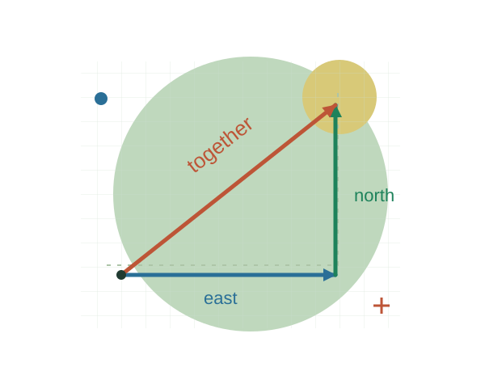
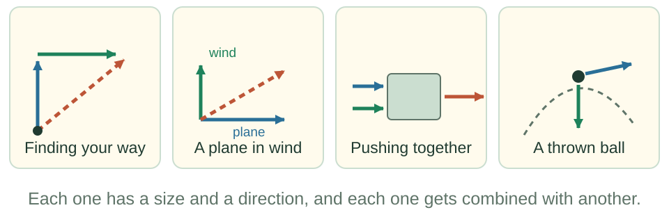
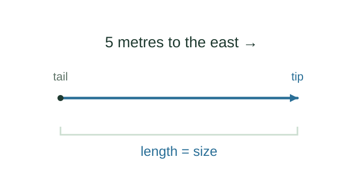
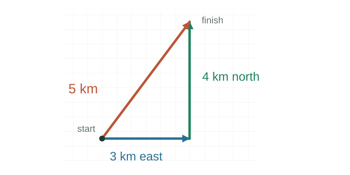
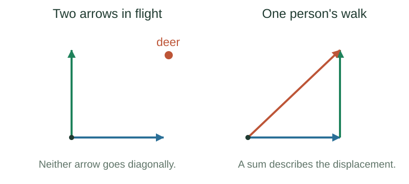
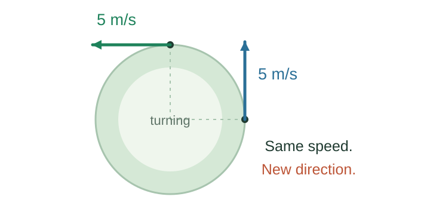
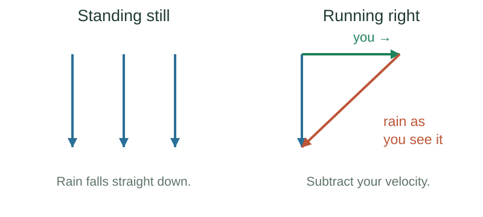
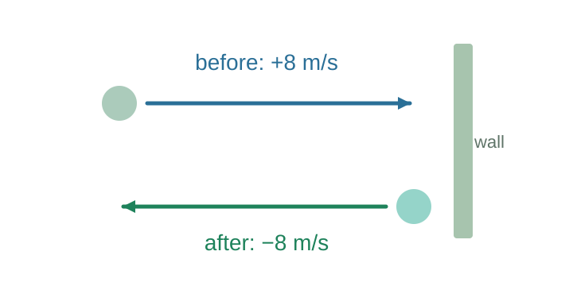
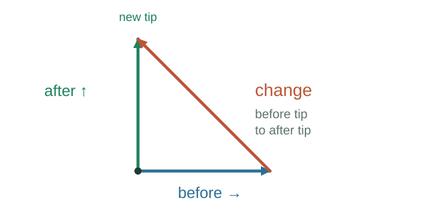
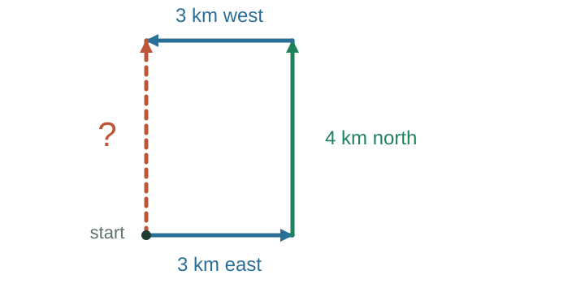

## Vectors {#vectors .cover background-color="#174a38" data-lesson-part="introduction"}

```{=html}
<p class="eyebrow">LECTURE 01 · TILEK ZHUMABEK</p><div class="cover-copy"><p>Vector arithmetic<br>and algebra.</p><p class="small-note">Vectors are everywhere in physics.<br>For our kinematics, we need to<br><strong>add, subtract, and use components.</strong></p><p class="cover-path">A short introduction → Addition &amp; subtraction</p></div>
```

::: {.notes}
Introduce the purpose, not a list of future topics. Today is a short introduction followed by two equal application blocks. Our vector tools are addition, subtraction, and multiplication by ordinary numbers. Other vector operations are beyond the purpose of this course. Plan 6 minutes for the introduction, 20 minutes for addition, 20 minutes for subtraction, and 5 minutes to check the goals.
:::

## Vectors are everywhere in physics {#everywhere .wide-figure data-lesson-part="introduction"}

```{=html}
<p class="eyebrow">PART 1 · WHY VECTORS MATTER</p><div class="deck-art full"></div><div class="takeaway">Different parts of physics use vectors. We begin with <strong>displacement and velocity vectors</strong>: where something moves, and how its motion changes.</div><p class="small-note">The other examples show where vectors appear. They are not extra topics to learn today.</p>
```

::: {.notes}
Name the vector in every example. In quantum mechanics a state vector represents the state of a system and is used to calculate probabilities of measurement outcomes. It is not a little arrow pointing in ordinary space. In general relativity velocity vectors describe motion through space and time. These examples show the reach of the idea; no quantum or relativity methods are prerequisites today. Sources: IBM Quantum, https://quantum.cloud.ibm.com/learning/en/courses/use-a-qc-today/quantum-mechanics-basics ; David Tong, https://www.damtp.cam.ac.uk/user/tong/gr/grhtml/S2.html . Move to the goals: our practical task is vector arithmetic for kinematics.
:::

## Our goals: combine motions, find changes {#todays-goal data-lesson-part="introduction"}

```{=html}
<p class="eyebrow">PART 1 · THE ROUTE THROUGH TODAY</p><p><strong>A short introduction</strong> to arrows, then our main work:<br><strong>addition and subtraction</strong>, with equal time to practise each.</p><ol class="closing-list"><li><strong>Add two vectors</strong> and explain what the sum means.</li><li><strong>Calculate with components</strong> using the distributive rule.</li><li><strong>Subtract two vectors</strong> and explain the difference.</li><li><strong>Use a change to describe motion</strong>: displacement, average velocity, and average acceleration.</li></ol><div class="takeaway">The parallelogram rule and ordinary arithmetic are the foundation. These are the vector tools our kinematics needs.</div>
```

::: {.notes}
Read the four goals in words. Give addition and subtraction the same time: 20 minutes each, including two practice problems each. The introduction is preparation, not a second course in vector theory. Return to these exact four goals at the end. Motion equations will tell us how objects behave; today supplies the vector tools.
:::

## Size and direction: a starting point {#size-and-direction data-lesson-part="introduction"}

```{=html}
<p class="eyebrow">PART 1 · WHAT MAKES A VECTOR?</p><div class="deck-art full"></div><div class="duo"><div class="tile"><p class="label">Scalar</p><p>Mass, time, temperature.<br>A size; no direction needed.</p></div><div class="tile teal"><p class="label">Vector</p><p>Displacement, velocity, force.<br>Size, direction, and addition rules.</p></div></div>
```

::: {.notes}
Define tail and tip and choose a drawing scale. Explain that velocity means speed and direction. Keep the starting definition tied to displacement and velocity; quantum state vectors are a broader use of the idea. Next compare two descriptions of one displacement. We will introduce the addition rules before testing them.
:::

## Two descriptions, one displacement {#same-displacement data-lesson-part="introduction"}

```{=html}
<p class="eyebrow">PART 1 · THE VECTOR AND ITS COMPONENTS</p><div class="deck-grid art-wide"><div class="deck-art"></div><div class="deck-copy"><p><strong>Aida:</strong> “5 km towards the river.”</p><p><strong>Baurzhan:</strong> “3 km east and 4 km north.”</p><p>Same start and finish.<br><strong>Different descriptions.</strong></p></div></div><div class="takeaway">Turn the coordinate axes: the component numbers change. The displacement does not.</div>
```

::: {.notes}
The river is at the stated endpoint. The two routes need not be the same: 3 + 4 is 7 km travelled along the legs; the diagonal is 5 km. The shared quantity is displacement, not the route. Define components as parts along chosen axes. This completes the introduction. Ask: how do we combine the two component arrows to recover the diagonal? Introduce the addition construction next.
:::

## Addition: two drawings of the same sum {#addition-rule .wide-figure data-lesson-part="addition"}

```{=html}
<p class="eyebrow">PART 2A · ADDITION · 1 OF 10</p><div class="deck-art full"></div><div class="duo"><div class="tile"><p class="label">Tip to tail</p><p>Draw from the first tail<br>to the final tip.</p></div><div class="tile teal"><p class="label">Parallelogram</p><p>Start at the shared tail<br>and draw the diagonal.</p></div></div>
```

::: {.notes}
Begin the 20-minute addition block. Draw both constructions and move the second arrow between them, keeping length and direction. Name the arrows a and b; the diagonal is their sum, also called the resultant. Once both constructions are clear, challenge their physical meaning immediately: can two flying arrows combine in this way? Do not introduce the order rule yet; it belongs with the familiar arithmetic of the apples.
:::

## Can the hunters' arrows add this way? {#hunters data-lesson-part="addition"}

```{=html}
<p class="eyebrow">PART 2A · ADDITION · 2 OF 10</p><p>The hunters saw a deer to the north-east. They fired one arrow east and one north,<br>then waited for the arrows to add together.</p><div class="deck-art full"></div><div class="takeaway">Two separate objects do not merge because we add their velocity arrows.</div><p class="small-note source-note">A story adapted from Banesh Hoffmann, <em>About Vectors</em>.</p>
```

::: {.notes}
Tell the original story rather than reading it. Keep the punchline: no trace of the hunters was ever found. We have just learned a valid mathematical construction; the hunters used it to predict something it does not describe. The velocity sum is defined, but it is not the actual velocity of either flying arrow. Contrast one person taking successive steps. Next resolve the challenge with the swimmer: two velocity contributions describe one motion.
:::

## Where you already add vectors {#addition-in-use .wide-figure data-lesson-part="addition"}

```{=html}
<p class="eyebrow">PART 2A · ADDITION · 3 OF 10</p><div class="deck-grid art-wide"><div class="deck-art"></div><div class="deck-copy"><p>A swimmer moves across at<br><strong>4 m/s relative to the water</strong>.<br>The current carries them at <strong>3 m/s</strong>.</p><p>Relative to the bank they move at<br><strong>5 m/s</strong>, at an angle.</p><p class="small-note">A plane in wind uses the same velocity addition. Forces on a box also add as vectors.</p></div></div><div class="takeaway">Adding answers one question: <strong>what is the combined vector?</strong></div>
```

::: {.notes}
Calculate the 3-4-5 triangle. Say each relationship: swimmer relative to water, water relative to bank, swimmer relative to bank. This resolves the hunters challenge: the two contributions describe the motion of one swimmer as seen from the bank. A plane in wind works the same way; forces on a box also have a meaningful vector sum. Now that the drawing and its physical meaning are clear, ask which familiar arithmetic rules let us calculate with the parts. Start with the apples, including order and grouping together.
:::

## Three bags of apples: order and grouping {#apples data-lesson-part="addition"}

```{=html}
<p class="eyebrow">PART 2A · ADDITION · 4 OF 10</p><div class="deck-art full"></div>
```

::: {.duo}
::: {.tile}
**Order:** $2+3=3+2$.

Vector addition works the same way:<br>
$\mathbf{a}+\mathbf{b}=\mathbf{b}+\mathbf{a}$.
:::
::: {.tile .teal}
**Grouping:** $3(2+3)=3\times2+3\times3$.

Multiply the whole, or each part.<br>
This is the **distributive rule**.
:::
:::

::: {.notes}
Count apples in two ways. First count red then green, or green then red: same sum. Connect this to the earlier parallelogram: walking east then north or north then east gives the same displacement. State a + b = b + a here. Second count bag by bag or colour by colour: 3(2+3) = 3×2 + 3×3. These are two familiar arithmetic rules, now in one place. Before applying them to vector components, challenge the first rule: does every quantity with a size and direction keep the same result when its order is reversed? The book tests exactly that question next.
:::

## Does the order rule work for book turns? {#book-test .wide-figure data-lesson-part="addition"}

```{=html}
<p class="eyebrow">PART 2A · ADDITION · 5 OF 10</p><div class="deck-art full"></div><div class="takeaway">The same two 90° turns give different final orientations. These turns do not add like displacement vectors.</div>
```

::: {.notes}
We have just seen the order rule for apples and displacement vectors. Now test whether size and direction alone guarantee that rule. Fix vertical and horizontal axes through the book centre relative to the room. Use the same turn senses and reset the initial orientation before reversing the sequence. Different final orientations mean these turns fail the order rule. Do not conclude that a single passed test proves every vector property. Return to displacement vectors, which do follow the rules: next show how repeated walks obey the distributive rule from the apples.
:::

## Back to walks: multiply the whole or the parts {#distributive-rule data-lesson-part="addition"}

```{=html}
<p class="eyebrow">PART 2A · ADDITION · 6 OF 10</p><div class="deck-grid art-wide"><div class="deck-art"></div><div class="deck-copy"><p>Repeat the pair of steps <strong>three times</strong>.</p><p>Or take <strong>three of each step</strong>, then combine them.</p><p>Different routes.<br><strong>Same displacement.</strong></p></div></div>
```

::: {.takeaway}
$n(\mathbf{a}+\mathbf{b})=n\mathbf{a}+n\mathbf{b}$, where $n$ is an ordinary number.
:::

::: {.notes}
Return explicitly to the two rules introduced with the apples. The book showed why we must check them before applying vector arithmetic. For displacement vectors we may regroup the steps: a,b,a,b,a,b can be rearranged as a,a,a,b,b,b without changing the finish. That gives 3(a+b) = 3a+3b. Explain n as an ordinary multiplier; 3 triples an arrow and −1 reverses it. The next step replaces the multiplier by elapsed time to calculate motion with components.
:::

## Let the multiplier be a time {#time-and-components data-lesson-part="addition"}

```{=html}
<p class="eyebrow">PART 2A · ADDITION · 7 OF 10</p><p>For <strong>constant velocity</strong>, displacement = velocity × elapsed time.</p>
```

::: {.formula}
$$\mathbf{v}t=(\mathbf{v}_x+\mathbf{v}_y)t
=\mathbf{v}_x t+\mathbf{v}_y t$$
:::

```{=html}
<div class="duo"><div class="tile"><p class="label">Whole motion</p><p>Multiply the complete velocity<br>by the time.</p></div><div class="tile teal"><p class="label">Its components</p><p>Multiply each velocity component<br>by that same time, then add.</p></div></div><div class="takeaway">The same distributive rule. One time interval for both parts.</div>
```

::: {.notes}
Define vx and vy as vector components along chosen perpendicular axes. The names a and b have become velocity components and the multiplier is time t. The dimensions are velocity × time = displacement. Do not apply constant v times t to the entire accelerated vertical fall; the next slide explicitly handles gravity.
:::

## Two bullets, one falling motion {#falling-components data-lesson-part="addition"}

```{=html}
<p class="eyebrow">PART 2A · ADDITION · 8 OF 10</p><div class="deck-art full"></div>
```

::: {.duo}
::: {.tile}
**Horizontal:** $x=v_{0x}t$

The horizontal speed stays constant.
:::
::: {.tile .teal}
**Downward:** $y=\tfrac12gt^2$

Both start with zero vertical speed.
:::
:::

```{=html}
<p class="small-note" style="margin-top:20px">Constant gravity, no air resistance, equal starting heights, and level ground.</p>
```

::: {.notes}
Explain x and y measured from the launch point, with downward positive. Gravity accelerates both bullets vertically in the same way. Equal fall distance and equal initial vertical speed give equal landing times. Algebra permits component calculations; the physical model makes these component equations independent. Ask: if the horizontal speed doubles, does the fall time change? No: the vertical equation stays the same. The horizontal distance doubles. Algebra lets us calculate with parts; physics tells us the equations for those parts.
:::

## Problem 1 · A bullet fired sideways {#problem-projectile .practice-slide data-lesson-part="addition"}

```{=html}
<p class="eyebrow">PART 2A · ADDITION · 9 OF 10</p><p>A bullet is fired horizontally at <strong>100 m/s</strong>, from <strong>45 m</strong> above level ground.<br>Find its time in the air and horizontal distance. Use <strong>g = 10 m/s²</strong>.</p><div class="duo"><div class="tile"><p class="label">Start vertically</p><p>How long does it take<br>to fall 45 m?</p></div><div class="tile teal"><p class="label">Then horizontally</p><p>How far does it move<br>during that same time?</p></div></div>
```

<details>
<summary>Show the solution</summary>

::: {.answer}
$45=\tfrac12(10)t^2$, so **$t=3$ s**.

Then $x=100\times3=\mathbf{300}$ m. A dropped bullet also takes 3 s.
:::

</details>

```{=html}
<p class="small-note" style="margin-top:15px">Assume constant gravity and no air resistance.</p>
```

::: {.notes}
Give students a sketch and reasoning pause. Initial vertical speed is zero. Use positive downward distance for the 45 m fall. The full worked explanation is retained in the notes. Ask which physical assumption makes horizontal velocity constant.
:::

## Problem 2 · Crossing a river {#problem-river .practice-slide data-lesson-part="addition"}

```{=html}
<p class="eyebrow">PART 2A · ADDITION · 10 OF 10</p><p>The river is <strong>100 m wide</strong>. Swim straight across at <strong>5 m/s relative to the water</strong>.<br>The steady current is <strong>3 m/s downstream</strong>.</p><div class="duo"><div class="tile"><p class="label">Across</p><p>Find the crossing time.</p></div><div class="tile teal"><p class="label">Along</p><p>Find the downstream distance<br>and speed relative to the bank.</p></div></div>
```

<details>
<summary>Show the solution</summary>

::: {.answer}
**Time:** $100/5=\mathbf{20}$ s. **Downstream:** $3\times20=\mathbf{60}$ m.

**Speed from the bank:** $\sqrt{5^2+3^2}\approx\mathbf{5.8}$ m/s.
:::

</details>

::: {.notes}
The three original questions all remain. The current is uniform, downstream, and has no across-river component. Swimming straight across is relative to the water, not a requirement to land opposite the starting point. The speed from the bank is the length of the velocity sum. Close the addition block: we drew a sum, calculated with components, and applied the result. The next question reverses the task: if we know before and after, what arrow takes us from one to the other?
:::

## Subtraction: find the missing arrow {#subtraction-order .wide-figure data-lesson-part="subtraction"}

```{=html}
<p class="eyebrow">PART 2B · SUBTRACTION · 1 OF 10</p><p>If <strong>b + change = a</strong>, then the change is <strong>a − b</strong>.</p><div class="deck-art full"></div><div class="takeaway"><strong>a − b = a + (−b).</strong> The same addition rule, with one arrow reversed.<br>Swap the order and the difference points the other way.</div>
```

::: {.notes}
Start the equally weighted 20-minute subtraction block. Motivate it with a car changing velocity, a runner seeing rain, and a walk ending elsewhere. Addition combines; subtraction compares. Draw b + change = a, then both equivalent constructions. The tail-to-tail difference goes from the subtracted vector b tip to vector a tip. A change over time is after minus before; an observer comparison uses object minus observer. Next calculate the same drawing using components.
:::

## Subtract the components, one by one {#component-subtraction .wide-figure data-lesson-part="subtraction"}

```{=html}
<p class="eyebrow">PART 2B · SUBTRACTION · 2 OF 10</p><p>A car changes from <strong>20 m/s east</strong> to <strong>20 m/s north</strong>.</p><div class="deck-art full"></div><div class="takeaway">Check by adding back: <strong>(20, 0) + (−20, 20) = (0, 20)</strong>.<br>The change takes the before vector to the after vector.</div>
```

::: {.notes}
Choose east and north as positive. Explain each number and unit. Reversing the before vector reverses its components; distributivity lets us group parts along the same axis. This is the same arithmetic as addition. Negative east means west, not a negative speed. Ask students to point to each component on the drawing. Later the car practice asks for the length of this change and the average acceleration. Next ask how quickly this change happened.
:::

## Subtraction is how we measure change {#measuring-change data-lesson-part="subtraction"}

```{=html}
<p class="eyebrow">PART 2B · SUBTRACTION · 3 OF 10</p><p>Adding combines quantities. Subtracting compares them.<br><strong>Δ</strong> (“delta”) means change; <strong>Δt</strong> is the elapsed time.</p>
```

| Quantity | Vector calculation |
|---|---|
| Displacement | $\Delta\mathbf{r}=\mathbf{r}_2-\mathbf{r}_1$ |
| Average velocity | $\mathbf{v}_{\mathrm{avg}}=\Delta\mathbf{r}/\Delta t$ |
| Average acceleration | $\mathbf{a}_{\mathrm{avg}}=\Delta\mathbf{v}/\Delta t$ |

```{=html}
<div class="takeaway">First find the change. Then divide by the elapsed time to find its average rate.</div>
```

::: {.notes}
Define r as position and v as velocity. The subscripts 1 and 2 mean before and after. These finite-interval rates are averages, not automatically instantaneous velocity or acceleration. Explain that a rate tells us how much changes per second. Test this next: can velocity change when speed stays the same?
:::

## Same speed. Is there acceleration? {#turning-question data-lesson-part="subtraction"}

```{=html}
<p class="eyebrow">PART 2B · SUBTRACTION · 4 OF 10</p><div class="deck-grid art-wide"><div class="deck-art"></div><div class="deck-copy"><p>A car travels around a circle<br>at a steady <strong>5 m/s</strong>.</p><p>Speed before: <strong>5 m/s</strong>.<br>Speed after: <strong>5 m/s</strong>.</p><p><strong>Has its velocity changed?</strong></p></div></div><div class="takeaway">A speed reading gives the length of the velocity arrow. We also need its direction.</div>
```

::: {.notes}
Let students state their reasoning before answering. Both vectors have equal magnitude. The direction changes. Introduce the next slide as a way to see the difference rather than merely accept the answer.
:::

## Move the tails together, then compare {#circle-subtraction .wide-figure data-lesson-part="subtraction"}

```{=html}
<p class="eyebrow">PART 2B · SUBTRACTION · 5 OF 10</p><div class="deck-art full"></div><div class="takeaway">From the tip of v₁ to the tip of v₂: that is Δv. It is not zero, so the car accelerates.</div>
```

::: {.notes}
Draw the velocities along the direction of travel at two points. Copy them tail to tail without changing length or direction, then join the before tip to the after tip. This is the same subtraction construction as before. Dividing this nonzero difference by the elapsed time gives nonzero average acceleration. Next distinguish a change in direction from a change in speed.
:::

## Turning and changing speed {#acceleration-components .wide-figure data-lesson-part="subtraction"}

```{=html}
<p class="eyebrow">PART 2B · SUBTRACTION · 6 OF 10</p><div class="deck-art full"></div><div class="duo"><div class="tile"><p class="label">Perpendicular to velocity</p><p>Changes the direction.<br>Constant-speed circular motion uses this.</p></div><div class="tile teal"><p class="label">Along the velocity</p><p>Changes the speed.<br>Opposite the velocity means slowing down.</p></div></div>
```

::: {.notes}
Keep the physical distinction: the acceleration at a moment can change speed, direction, or both. Acceleration across the velocity changes direction; the part along or against velocity changes speed. Do not claim that every finite velocity difference is perpendicular to the initial velocity. No magnitude formula is needed. Next show that subtraction can also compare two observers, not just two times.
:::

## Rain: the observer changes {#rain .wide-figure data-lesson-part="subtraction"}

```{=html}
<p class="eyebrow">PART 2B · SUBTRACTION · 7 OF 10</p><div class="deck-art full"></div>
```

::: {.takeaway}
$\mathbf{v}_{\text{rain seen by you}}
=\mathbf{v}_{\text{rain}}-\mathbf{v}_{\text{you}}$
:::

```{=html}
<p class="small-note" style="margin-top:16px">Measure both velocities on the right relative to the ground. Run faster: the rain looks more slanted.</p>
```

::: {.notes}
Restore the original everyday example. The rain's ground-frame velocity is unchanged; the moving observer sees a different relative velocity. On the figure, blue and green tails share a point; the coral arrow from the green tip to the blue tip is rain minus runner. This is object minus observer, not later minus earlier. Relate this to the swimmer: rearranging velocity addition gives velocity subtraction. Next apply the same minus sign to a reversal of motion.
:::

## A rebound changes more than a stop {#bounce .wide-figure data-lesson-part="subtraction"}

```{=html}
<p class="eyebrow">PART 2B · SUBTRACTION · 8 OF 10</p><div class="deck-art full"></div>
```

::: {.duo}
::: {.tile}
**Bounce:** $-8-(+8)=-16$ m/s.
:::
::: {.tile .teal}
**Stop:** $0-(+8)=-8$ m/s.
:::
:::

```{=html}
<div class="takeaway">The bounce changes velocity by twice as much as the stop—even though the rebound speed is unchanged.</div>
```

::: {.notes}
Choose right as positive before doing arithmetic. Speed changes by zero in the ideal equal-speed rebound, but velocity changes by minus 16 metres per second. Ask why the answer points left. Compare the same calculation for stopping. Now practise subtraction twice: first a velocity change, then a position change.
:::

## Problem 3 · Turning a corner {#problem-car .practice-slide data-lesson-part="subtraction"}

```{=html}
<p class="eyebrow">PART 2B · SUBTRACTION · 9 OF 10</p><div class="deck-grid art-wide"><div class="deck-art"></div><div class="deck-copy"><p><strong>Before:</strong> 20 m/s east.<br><strong>After:</strong> 20 m/s north.<br><strong>Time:</strong> 4 s.</p><p>Find the velocity change<br>and average acceleration.</p></div></div>
```

<details>
<summary>Show the solution</summary>

::: {.answer}
$|\Delta\mathbf{v}|=\sqrt{20^2+20^2}\approx\mathbf{28.3}$ m/s, **north-west**.

Average acceleration: $28.3/4\approx\mathbf{7.1}$ m/s², **north-west**.
:::

</details>

::: {.notes}
Have students put the arrows tail to tail first. Distinguish zero speed change from nonzero velocity change. The acceleration computed is averaged over 4 s; instantaneous acceleration need not keep that direction. Connect the answer to the earlier component calculation: delta v = (−20,+20) m/s and average a = (−5,+5) m/s². The next problem uses the same subtraction for position instead of velocity.
:::

## Problem 4 · A walk {#problem-walk .practice-slide data-lesson-part="subtraction"}

```{=html}
<p class="eyebrow">PART 2B · SUBTRACTION · 10 OF 10</p><div class="deck-grid art-wide"><div class="deck-art"></div><div class="deck-copy"><p>Start at <strong>(2, 1) km</strong>.<br>Walk <strong>3 km east, 4 km north,<br>then 3 km west</strong>.</p><p>Find the final position,<br>displacement, and distance.</p><p class="small-note">Coordinates: (east, north).</p></div></div><details><summary>Show the solution</summary><div class="answer"><p><strong>Finish: (2, 5) km.</strong> Displacement: (2, 5) − (2, 1) = (0, 4) km.<br><strong>4 km north.</strong> Distance: 3 + 4 + 3 = <strong>10 km</strong>.</p></div></details>
```

::: {.notes}
Sketch the coordinate origin away from the start so students see why final position is not itself displacement. The east and west walks cancel; the finish is (2,5), and after minus before gives (0,4). Compare with the lap example in the notes: the finish equals the start so displacement is zero, while distance is not. Close the subtraction block: draw a difference, calculate with components, interpret the change.
:::

## Which question are you answering? {#choose-operation data-lesson-part="review"}

```{=html}
<p class="eyebrow">FINISH · CHECK YOUR REASONING</p><div class="duo"><div class="tile"><p class="label">Combine motions</p><p>A swimmer moves through water.<br>The water moves past the bank.</p><p><strong>How does the swimmer move<br>relative to the bank?</strong></p></div><div class="tile teal"><p class="label">Compare before and after</p><p>A runner finishes a full lap,<br>back at the starting point.</p><p><strong>What is the displacement?<br>Did the runner stay still?</strong></p></div></div><details><summary>Check the two operations</summary><div class="answer"><p><strong>Add</strong> swimmer-relative-to-water and water-relative-to-bank velocities.<br><strong>Subtract</strong> start position from finish position: zero displacement.<br>The runner moved; displacement tells us about the endpoints.</p></div></details>
```

::: {.notes}
Give both questions equal discussion time. Ask students to choose the operation before calculating and to explain the physical meaning of their answer. For the lap, use 400 m in 100 s if useful: average speed 4 m/s, average velocity zero. Invite a question about any step between the physical story, the arrow, and the numbers.
:::

## Back to our four goals {#recap background-color="#dcecdf" data-lesson-part="review"}

```{=html}
<p class="eyebrow">FINISH · WHAT YOU HAVE PUT INTO PRACTICE</p><ol class="closing-list"><li><strong>Add two vectors.</strong> The swimmer and current combine by the parallelogram rule.</li><li><strong>Calculate with components.</strong> The apples rule becomes the distributive rule for motion.</li><li><strong>Subtract two vectors.</strong> Reverse and add, or draw from the before tip to the after tip.</li><li><strong>Use a change to describe motion.</strong> The walk gives displacement; the turning car gives average acceleration.</li></ol><div class="takeaway">You have used the vector arithmetic and algebra our kinematics needs.<br>Which step would you like to draw or explain once more?</div><a class="end-link" href="index.html">Full explanations &amp; worked problems ↗</a>
```

::: {.notes}
Return explicitly to all four opening goals. For goal four recall average velocity = displacement / elapsed time, including the zero average velocity of the full lap. Ask students to explain one worked example in their own words. Our vector tools are now in place; the kinematics lessons add the motion equations. Reward questions about the reasoning, not just correct numerical answers.
:::
